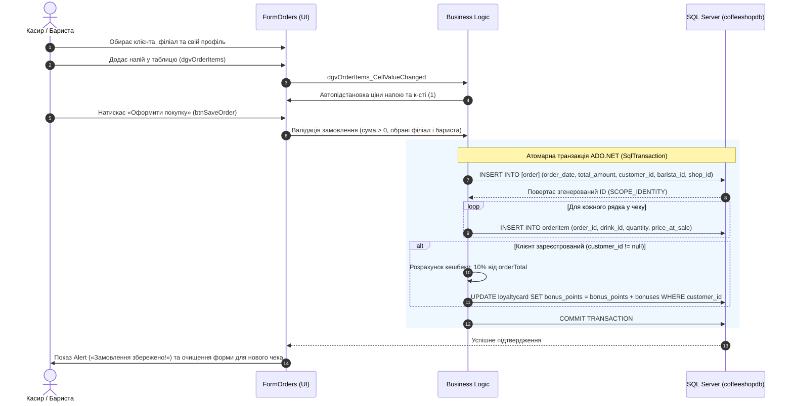

# Граф знань (Knowledge Graph) та архітектурний аналіз: CoffeeShopApp

Даний документ містить детальний граф знань, опис структури, інтерфейсу (UI/UX) та бізнес-логіки інформаційної системи мережі кав'ярень **CoffeeShopApp**.

---

## 1. Загальний граф знань системи (Knowledge Graph)

```mermaid
graph TD
    %% Модулі інтерфейсу
    subgraph UI_Modules ["Користувацький інтерфейс (UI/UX)"]
        MF["MainForm (Головне меню)"]
        FO["FormOrders (Оформлення та облік замовлень)"]
        FC["FormCustomers (Клієнти та картки лояльності)"]
        FB["FormBaristas (Керування персоналом/бариста)"]
        FA["FormAnalytics (Аналітичні звіти та OLAP)"]
    end

    %% Бізнес-логіка та обробники
    subgraph App_Logic ["Рівень бізнес-логіки (Logic & Rules)"]
        Calc["Розрахунок вартості замовлення (Sum = Qty * Price)"]
        Bonus["Нарахування 10% бонусів на картку лояльності"]
        Tx["Транзакційне збереження Master-Detail (Order + Items)"]
        CardGen["Перевірка та активація картки клієнта (1:1)"]
        StaffShift["Прив'язка бариста до філіалу"]
        OLAP["Аналітична агрегація (ROLLUP, CUBE, RANK)"]
    end

    %% СУБД та сутності даних
    subgraph DB_Entities ["Рівень даних (База даних: coffeeshopdb)"]
        E_Shop[("coffeeshop (Філіали кав'ярень)")]
        E_Barista[("barista (Співробітники)")]
        E_Customer[("customer (Клієнти)")]
        E_Card[("loyaltycard (Бонусні картки)")]
        E_Drink[("coffeedrink (Меню напоїв)")]
        E_Order[("[order] (Чеки / Замовлення)")]
        E_Item[("orderitem (Позиції замовлення)")]
    end

    %% Зв'язки між UI та логікою
    MF -->|Відкриває модально| FO
    MF -->|Відкриває модально| FC
    MF -->|Відкриває модально| FB
    MF -->|Відкриває модально| FA

    FO --> Calc
    FO --> Tx
    Tx --> Bonus

    FC --> CardGen
    FB --> StaffShift
    FA --> OLAP

    %% Зв'язки з базою даних
    StaffShift --> E_Barista
    StaffShift --> E_Shop

    CardGen --> E_Card
    CardGen --> E_Customer

    Tx --> E_Order
    Tx --> E_Item
    Calc --> E_Drink

    OLAP --> E_Order
    OLAP --> E_Item
    OLAP --> E_Drink
    OLAP --> E_Shop
    OLAP --> E_Barista

    %% Зв'язки між сутностями БД
    E_Shop ---|1 : N| E_Barista
    E_Shop ---|1 : N| E_Order
    E_Customer ---|1 : 1| E_Card
    E_Customer ---|1 : N| E_Order
    E_Barista ---|1 : N| E_Order
    E_Order ---|1 : N (Master-Detail)| E_Item
    E_Drink ---|1 : N| E_Item
```

---

## 2. Детальний аналіз UI/UX дизайну системи

Інтерфейс системи орієнтований на операційну роботу співробітників кав'ярні (бариста, касира, адміністратора) та керівника мережі.

### 2.1. Інформаційна архітектура та навігація
- **Централізована модель керування (Hub and Spoke):**
  - Головне вікно (`MainForm`) виступає єдиним хабом навігації.
  - Усі дочірні модулі відкриваються у режимі модальних діалогових вікон (`ShowDialog()`), що запобігає конфліктам паралельного редагування одних і тих самих записів у БД.
  - Позиціонування всіх вікон по центру екрана (`StartPosition = FormStartPosition.CenterScreen`) для зручності оператора.

### 2.2. Розбір екранів та елементів керування

| Форма / Екран | Візуальні контроли | UX-призначення та поведінка |
| :--- | :--- | :--- |
| **MainForm** (Панель керування) | • 4 великі кнопки навігації (`btnOrders`, `btnCustomers`, `btnBaristas`, `btnAnalytics`)<br>• Кнопка швидкого виходу `btnExit` | Ергономічний лаунчер. Кнопки з чіткими підписами та іконками дозволяють одним кліком перейти до потрібного бізнес-процесу. |
| **FormOrders** (Оформлення замовлень) | • Випадаючі списки вибору клієнта (`cbCustomer`), бариста (`cbBarista`), кав'ярні (`cbShop`)<br>• Таблиця позицій `dgvOrderItems` (напій, к-сть, ціна)<br>• Підсумковий індикатор суми `lblTotalDisplay`<br>• Кнопки «Порахувати», «Оформити покупку», «Скинути/Новий чек» | **Master-Detail інтерфейс:**<br>1. Вибір клієнта підтримує варіант *«-- Гість (без картки) --»* з `DBNull` для анонімних покупок.<br>2. У таблиці напоїв реалізовано ComboBox-колонку з автопідстановкою базової ціни при виборі напою.<br>3. Підсумкова сума виділена великим шрифтом для читабельності касиром.<br>4. Захист від помилок рендерингу через подію `DataError`. |
| **FormCustomers** (Клієнти та картки) | • Дві пов'язані таблиці: `dgvCustomers` (клієнти) та `dgvCards` (бонусні картки)<br>• Кнопка «Видати бонусну картку обраному клієнту» `btnCreateCard`<br>• Кнопки збереження змін | **Дворівнева візуалізація:**<br>Оператор обирає клієнта у верхній таблиці і натисканням однієї кнопки активує йому картку. Система автоматично перевіряє унікальність і виводить повідомлення про статус. |
| **FormBaristas** (Персонал) | • Сітка співробітників `dgvBaristas`<br>• Вбудована випадаюча колонка вибору філіалу `colShop`<br>• Кнопка «Зберегти зміни» `btnSave` | Замість ручного введення цифрового `shop_id` користувач бачить реальну назву філіалу у випадаючому списку прямо всередині таблиці. |
| **FormAnalytics** (Звітність OLAP) | • Випадаючий селектор типу звіту `cbQuerySelect`<br>• Кнопка «Виконати запит» `btnExecute`<br>• Таблиця результатів `dgvResults`<br>• Статусний рядок кількості рядків та часу `lblStatus` | Дашборд керівника. Зручний перегляд складних багатовимірних аналітичних зрізів без потреби знання мови SQL. |

### 2.3. Патерни UX та зворотний зв'язок (User Feedback)
1. **Інформативні модальні повідомлення:**
   - Попередження при спробі оформити порожнє замовлення (`MessageBoxIcon.Warning`).
   - Попередження про невибраного бариста або філіал.
   - Повідомлення про успішне збереження із зазначенням номера згенерованого чека (`Замовлення №{id} успішно збережено!`).
2. **Захист від дублювання та помилок:**
   - Заборона повторної видачі картки клієнту, якщо вона вже існує.
   - Поля ID заблоковані для редагування користувачем (`ReadOnly = true`), щоб запобігти порушенню первинних ключів.
   - Автоматичне заповнення значення кількості порцій `1` за замовчуванням при додаванні напою.

---

## 3. Детальний аналіз бізнес-логіки додатка



### 3.1. Схема даних та сутності (Entity-Relationship)
1. **`coffeeshop`:** Довідник локацій мережі (`shop_id`, `name`, `address`).
2. **`barista`:** Співробітники (`barista_id`, `name`, `phone`, `shop_id`). Пов'язаний з кав'ярнею відношенням N:1.
3. **`customer`:** Клієнтська база (`customer_id`, `name`, `phone`, `email`).
4. **`loyaltycard`:** Картки програми лояльності (`card_id`, `customer_id`, `bonus_points`, `issue_date`). Зв'язок 1:1 з клієнтом.
5. **`coffeedrink`:** Меню товарів (`drink_id`, `name`, `price`).
6. **`[order]`:** Заголовки чеків (`order_id`, `order_date`, `total_amount`, `customer_id`, `barista_id`, `shop_id`).
7. **`orderitem`:** Специфікація чека (`order_item_id`, `order_id`, `drink_id`, `quantity`, `price_at_sale`). Зв'язок N:1 з чеком та напоєм.

### 3.2. Ключові бізнес-правила:
- **Розрахунок чека:**
  $$\text{Total} = \sum_{i=1}^{n} (\text{Quantity}_i \times \text{PriceAtSale}_i)$$
- **Програма лояльності (Кешбек 10%):**
  Якщо покупець ідентифікований (обраний у системі), йому на картку лояльності автоматично нараховується 10% від вартості замовлення:
  $$\text{Bonuses} = \text{Round}(\text{Total} \times 0.10)$$
- **Цілісність продажу:**
  У таблицю `orderitem` фіксується саме `price_at_sale` (фактична ціна на момент продажу). Це гарантує, що при зміні цін у меню в майбутньому історичні фінансові звіти не спотворяться.
- **Транзакційність (ACID):**
  Запис замовлення, додавання рядків чека та оновлення бонусів відбуваються всередині єдиної транзакції `conn.BeginTransaction()`. У разі будь-якого збою викликається `transaction.Rollback()`, що захищає базу даних від неповних або пошкоджених записів.

### 3.3. Аналітична підсистема (OLAP):
1. **Ієрархічний звіт з виручки (`ROLLUP`):**
   Групування `ROLLUP(cs.name, cd.name)` дозволяє отримати сумарну виручку по кожному напою, проміжний підсумок по кожній кав'ярні та фінальний глобальний підсумок по всій мережі.
2. **Рейтинг персоналу (Віконні функції `RANK` та `DENSE_RANK`):**
   Визначає місце бариста в загальному рейтингу мережі за обсягом виручки, а також локальне місце бариста всередині його власного філіалу (`PARTITION BY cs.shop_id`).
3. **Багатовимірний аналіз попиту (`CUBE`):**
   Аналізує перехресну популярність усіх категорій продукції по всіх можливих комбінаціях локацій.
