# Вимоги до оформлення звітів з лабораторних робіт 1-3 та повні тексти звітів

Цей документ містить вимоги до оформлення та захисту звітів з дисципліни «Інтернет-програмування» (за матеріалами лекцій і консультацій), а також повні академічні тексти звітів для лабораторних робіт №1, №2 та №3 (повністю ідентичні змісту файлів .docx).

---

## 1. Загальні вимоги до оформлення та захисту

1. **Подання робіт:** звіти завантажуються в електронну систему дистанційного навчання (LMS «Лідер»).
2. **Процедура захисту:** на занятті в Zoom студент демонструє звіт і показує роботу сайту в браузері.
3. **Структура звіту:**
   - Титульний аркуш (назва університету, кафедра, дисципліна, номер і тема роботи, дані студента та викладача, місто, рік).
   - Тема та мета роботи.
   - Короткий опис предметної області (наскрізний проєкт «Coffee Shop»).
   - Таблиця реалізованих елементів (теги HTML / властивості CSS / методи JS).
   - Лістинг вихідного коду з пояснювальними коментарями.
   - Скриншоти інтерфейсу в браузері.
   - Висновки.

---
---

# ЧАСТИНА 1. ЗВІТ ДЛЯ ЛАБОРАТОРНОЇ РОБОТИ №1 (HTML)

```text
МІНІСТЕРСТВО ОСВІТИ І НАУКИ УКРАЇНИ
УКРАЇНСЬКИЙ ДЕРЖАВНИЙ УНІВЕРСИТЕТ НАУКИ І ТЕХНОЛОГІЙ
Кафедра комп'ютерних інформаційних технологій
ЗВІТ
з лабораторної роботи №1
з дисципліни «Інтернет-програмування»
на тему: «Створення HTML-документа»
Виконала:
студентка групи ПЗ2313
Бондаренко Поліна Євгенівна
Перевірив:
доц. Андрющенко Вадим Олександрович
Дніпро 2026
```

**Тема: створення HTML-документа.**

**Мета роботи: навчитися будувати структуру веб-сторінок мовою HTML: оформлювати заголовки й текст, створювати списки різних типів, таблиці з об'єднаними комірками, вставляти зображення та гіперпосилання, накладати на зображення карту з активними областями та вбудовувати одну сторінку в іншу за допомогою фрейму.**

## 1 ПОСТАНОВКА ЗАВДАННЯ

Згідно з методичними вказівками потрібно створити HTML-документ, у якому використано текстові блоки й заголовки, форматування тексту, списки, гіперпосилання, зображення та таблиці. На консультації до лабораторної роботи викладач уточнив вимоги:

- сайт має складатися щонайменше з трьох-чотирьох сторінок, пов'язаних гіперпосиланнями;
- у таблицях потрібно об'єднати комірки по горизонталі та по вертикалі, наприклад зробити дворівневу шапку;
- на зображення потрібно накласти карту (<map>, <area>) з областями різної форми, де кожна область має власну спливаючу підказку та власне посилання;
- фрейми можна додати за бажанням.
Усі лабораторні роботи курсу виконуються в межах однієї предметної області: кожна наступна робота додає до вже створеного сайту новий шар (стилі, поведінку, роботу із сервером).

## 2 ОПИС ПРЕДМЕТНОЇ ОБЛАСТІ

Як предметну область обрано інформаційну систему мережі кав'ярень «Coffee Shop». Вона взята з мого курсового проєкту: настільного застосунку CoffeeShopApp (C#, Windows Forms) з базою даних coffeeshopdb на SQL Server. Веб-версія повторює структуру застосунку: кожній формі відповідає окрема сторінка сайту (таблиця 2.1).

**Таблиця 2.1 - Відповідність форм застосунку CoffeeShopApp і сторінок сайту**

| Форма WinForms | Сторінка | Вміст сторінки |
| --- | --- | --- |
| MainForm | index.html | інформація про мережу, пропозиції, меню, новини, таблиця філіалів, карта, фрейм швидкого замовлення |
| FormOrders | orders.html | форма нового чека (клієнт, бариста, філіал, напої), склад чека, останні чеки |
| FormCustomers | customers.html | пошук, таблиці клієнтів і карток лояльності, правила бонусної програми, форма реєстрації |
| FormBaristas | baristas.html | фільтр за філіалом, таблиця бариста, форма додавання працівника |
| FormAnalytics | analytics.html | вибір звіту та три звіти: ROLLUP, RANK/DENSE_RANK, CUBE |

Дані на сторінках узгоджені з таблицями бази coffeeshop, barista, customer, loyaltycard, coffeedrink, order та orderitem. Наприклад, виручка всієї мережі у звіті ROLLUP (27 375 грн) дорівнює сумі продажів усіх бариста у звіті RANK, а кількість проданих порцій у звіті CUBE збігається з кількістю у звіті ROLLUP. Це знадобиться в наступних роботах, коли сторінки отримуватимуть дані з бази.

## 3 ХІД ВИКОНАННЯ РОБОТИ

### 3.1 Структура сторінок і навігація

Усі п'ять сторінок мають однакову будову: шапка <header> з логотипом і назвою, меню <nav>, основний вміст <main>, поділений на розділи <section>, і підвал <footer>. Пункт меню поточної сторінки виділено тегом <b>. Пункти розділено символом «|» і горизонтальними лініями <hr>.

Логотип на головній сторінці розміщено всередині тега <a>, тому клік по ньому відкриває зображення в повному розмірі в новій вкладці (атрибут target="_blank"). Атрибут border="0" прибирає рамку, яку браузер малює навколо зображення-посилання. У тексті є зовнішнє посилання на статтю Вікіпедії, а в підвалі посилання mailto: для листа на пошту мережі.

**Лістинг 3.1 - Шапка та меню головної сторінки (index.html)**

```html
<header>
    <div align="center">
        <!-- логотип відкриває зображення у повному розмірі -->
        <a href="img/coffee_logo.png" target="_blank" title="Відкрити логотип у повному розмірі">
            
        </a>
        <h1>Мережа кав'ярень «Coffee Shop»</h1>
        <p><i>Свіжообсмажена кава, затишна атмосфера та привітні бариста у кожному філіалі</i></p>
    </div>
    <hr>
    <nav align="center">
        <b><a href="index.html">Головна</a></b> |
        <a href="orders.html">Оформлення замовлень</a> |
        <a href="customers.html">Клієнти та картки</a> |
        <a href="baristas.html">Співробітники</a> |
        <a href="analytics.html">Аналітика</a>
    </nav>
    <hr>
</header>
```

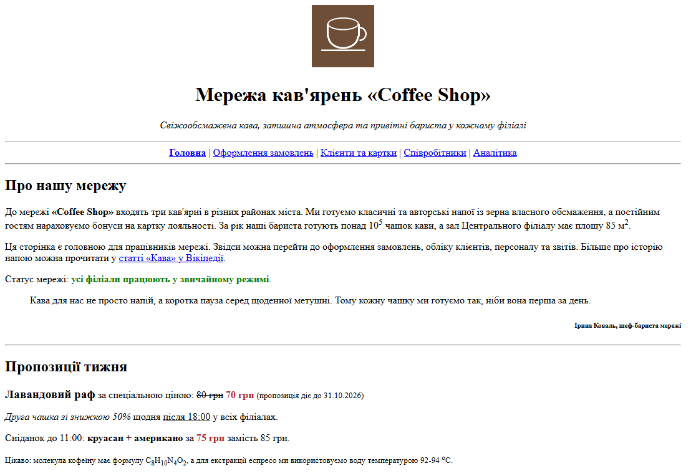

*Рисунок 3.1 - Початок головної сторінки index.html*

### 3.2 Текст і форматування

На сторінках використано всі шість рівнів заголовків: <h1> для назви сторінки, <h2> для розділів, <h3> для підрозділів, <h4> для заголовків новин і блоку «Контакти», <h5> у підвалі, а <h6> з атрибутом align="right" для підпису під цитатою, як у прикладі з методички. Абзаци задано тегом <p>, перенесення рядка в новинах тегом <br>, цитату шеф-бариста тегом <blockquote>.

Теги форматування застосовано за змістом, а не окремим демонстраційним блоком. У розділі «Пропозиції тижня» назва акційного напою виділена тегами <big> і <b>, стара ціна закреслена тегом <s>, нова ціна виділена кольором через <font color>, термін дії акції набрано тегом <small>, умова вечірньої акції виділена курсивом <i> і підкресленням <u>. Верхній індекс <sup> використано для степеня в кількості чашок за рік, для квадратних метрів площі залу та для позначки градусів, нижній індекс <sub> у формулі кофеїну C8H10N4O2.

**Лістинг 3.2 - Розділ «Пропозиції тижня» (index.html)**

```html
<h2>Пропозиції тижня</h2>
<p>
    <big><b>Лавандовий раф</b></big> за спеціальною ціною:
    <s>80 грн</s> <font color="#B22222"><b>70 грн</b></font>
    <small>(пропозиція діє до 31.10.2026)</small>
</p>
<p>
    <i>Друга чашка зі знижкою 50%</i> щодня <u>після 18:00</u> у всіх філіалах.
</p>
<p>
    Сніданок до 11:00: <b>круасан + американо</b> за <font color="#B22222"><b>75 грн</b></font>
    замість 85 грн.
</p>
<p>
    <small>Цікаво: молекула кофеїну має формулу C<sub>8</sub>H<sub>10</sub>N<sub>4</sub>O<sub>2</sub>,
    а для екстракції еспресо ми використовуємо воду температурою 92-94 <sup>o</sup>C.</small>
</p>
```

### 3.3 Списки

На головній сторінці використано такі види списків:

- маркерований список <ul type="square"> з квадратними маркерами (сорти кавового зерна);
- маркерований список <ul type="circle"> з маркерами-колами (послуги для гостей);
- нумерований список <ol> (етапи приготування капучино), у четвертий пункт якого вкладено ще один список <ol type="a"> з літерною нумерацією;
- нумерований список <ol type="I"> з римськими цифрами (розділи меню);
- список визначень <dl>, <dt>, <dd> (словник бариста).
На сторінці клієнтів правила бонусної програми поділено на дві частини. Між ними стоїть абзац, тому другий список має атрибут start="4", щоб нумерація продовжилася з четвертого пункту.

**Лістинг 3.3 - Нумерований список із вкладеним списком (index.html)**

```html
<h3>Як ми готуємо капучино</h3>
<ol>
    <li>Мелемо 18 г зерна безпосередньо перед приготуванням.</li>
    <li>Темперуємо каву із зусиллям близько 15 кг.</li>
    <li>Екстрагуємо еспресо 25-28 секунд під тиском 9 бар.</li>
    <li>Готуємо молоко:
        <ol type="a">
            <li>наливаємо холодне молоко в пітчер;</li>
            <li>збиваємо парою до 60-65 <sup>o</sup>C;</li>
            <li>вливаємо в еспресо, малюючи візерунок.</li>
        </ol>
    </li>
    <li>Подаємо гостю разом зі склянкою води.</li>
</ol>
```

**Лістинг 3.4 - Продовження нумерації атрибутом start (customers.html)**

```html
<h2>Правила програми лояльності</h2>
<ol>
    <li>Картку видаємо безкоштовно під час реєстрації клієнта.</li>
    <li>З кожного замовлення на картку повертається <b>10%</b> суми у вигляді бонусів.</li>
    <li>Один бонус дорівнює одній гривні знижки.</li>
</ol>
<p><i>Додаткові умови:</i></p>
<ol start="4">
    <li>Бонусами можна оплатити не більше половини чека.</li>
    <li>Бонуси, якими не користувалися 12 місяців, згорають.</li>
</ol>
```

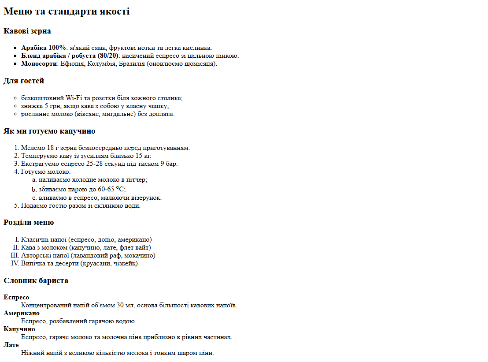

*Рисунок 3.2 - Списки різних типів на головній сторінці*

### 3.4 Таблиці

**Таблиця філіалів має дворівневу шапку. Стовпці «№» і «Філіал» об'єднано по вертикалі атрибутом rowspan="2", а заголовки «Контакти» і «Графік роботи» об'єднують по два стовпці атрибутом colspan="2". У тілі таблиці також є вертикальне об'єднання: філіали 2 і 3 у вихідні працюють однаково, тому ця комірка має rowspan="2", а в рядку третього філіалу її немає. Над таблицею розміщено підпис <caption>, шапку і тіло розділено тегами <thead> і <tbody>.**

Вигляд таблиць задано атрибутами з методички: border (товщина рамки), cellpadding (відступ від рамки до вмісту), cellspacing (відстань між комірками), width (ширина), bgcolor (колір фону рядка) та align (вирівнювання в комірці).

**Лістинг 3.5 - Таблиця філіалів з об'єднанням комірок (index.html)**

```html
<table border="1" cellpadding="8" cellspacing="0" width="100%">
    <caption><b>Таблиця 1. Адреси та графік роботи філіалів</b></caption>
    <thead>
        <tr bgcolor="#f0f0f0">
            <th rowspan="2">№</th>
            <th rowspan="2">Філіал</th>
            <th colspan="2">Контакти</th>
            <th colspan="2">Графік роботи</th>
        </tr>
        <tr bgcolor="#e8e8e8">
            <th>Адреса</th>
            <th>Телефон</th>
            <th>Пн-Пт</th>
            <th>Сб-Нд</th>
        </tr>
    </thead>
    <tbody>
        <tr>
            <td align="center">1</td>
            <td><b>Центральний</b></td>
            <td>вул. Хрещатик, 15</td>
            <td>+380 (44) 111-22-33</td>
            <td align="center">07:30-22:00</td>
            <td align="center">08:30-23:00</td>
        </tr>
        <tr>
            <td align="center">2</td>
            <td><b>Кав'ярня на Подолі</b></td>
            <td>Контрактова площа, 4</td>
            <td>+380 (44) 222-33-44</td>
            <td align="center">08:00-21:30</td>
            <!-- у філіалів 2 і 3 однаковий графік у вихідні -->
            <td align="center" rowspan="2">09:00-22:00</td>
        </tr>
        <tr>
            <td align="center">3</td>
            <td><b>Студентський куточок</b></td>
            <td>просп. Науки, 28</td>
            <td>+380 (44) 333-44-55</td>
            <td align="center">08:00-20:00</td>
        </tr>
    </tbody>
</table>
```

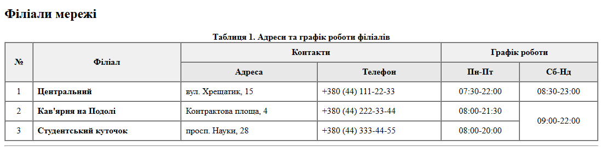

*Рисунок 3.3 - Таблиця філіалів з дворівневою шапкою*

Інші сторінки також містять таблиці: склад чека та останні чеки (orders.html), клієнти та картки лояльності (customers.html), бариста (baristas.html) і три звіти (analytics.html). У звітах проміжні підсумки виділено кольором фону через атрибут bgcolor (рисунок 3.4).

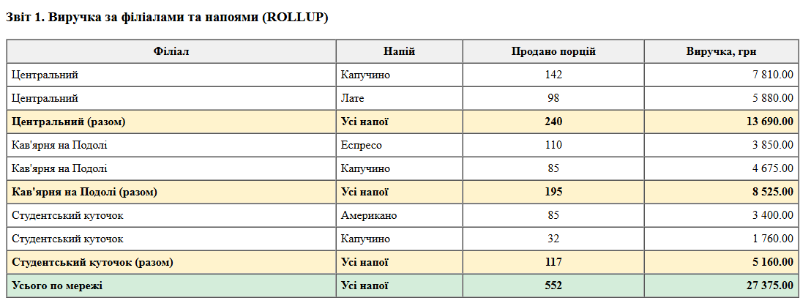

*Рисунок 3.4 - Звіт ROLLUP на сторінці analytics.html*

### 3.5 Зображення та карта зображення

Для карти мережі підготовлено зображення coffee_map.png розміром 600 на 200 пікселів, на якому схематично показано три філіали різної форми. Тегу  задано атрибут usemap="#shops-map", який зв'язує зображення з картою <map name="shops-map">. Усередині карти чотири області <area>:

- shape="rect": прямокутник, координати лівого верхнього та правого нижнього кутів (10,10,190,190);
- shape="circle": коло, координати центру та радіус (300,100,75);
- shape="poly": замкнута ламана, координати чотирьох вершин трапеції;
- shape="default": уся решта зображення, що не увійшла в інші області.
Кожна область має власну підказку title з адресою філіалу та власне посилання href. Області філіалів відкривають їхню адресу на Google Maps у новій вкладці, а область default переходить до таблиці філіалів на цій самій сторінці (посилання #branches на id розділу).

**Лістинг 3.6 - Зображення з картою активних областей (index.html)**

```html

<map name="shops-map">
    <area shape="rect" coords="10,10,190,190" alt="Центральний філіал"
          title="Центральний: вул. Хрещатик, 15"
          href="https://www.google.com/maps/search/?api=1&amp;query=Київ+вул.+Хрещатик+15" target="_blank">
    <area shape="circle" coords="300,100,75" alt="Кав'ярня на Подолі"
          title="Кав'ярня на Подолі: Контрактова площа, 4"
          href="https://www.google.com/maps/search/?api=1&amp;query=Київ+Контрактова+площа+4" target="_blank">
    <area shape="poly" coords="420,25,580,25,560,175,420,175" alt="Студентський куточок"
          title="Студентський куточок: просп. Науки, 28"
          href="https://www.google.com/maps/search/?api=1&amp;query=Київ+проспект+Науки+28" target="_blank">
    <area shape="default" alt="Усі філіали" title="Таблиця з адресами всіх філіалів" href="#branches">
</map>
```

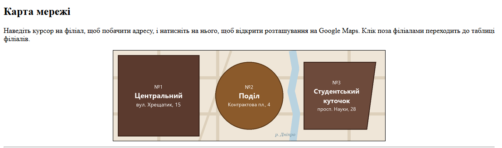

*Рисунок 3.5 - Карта мережі з трьома областями філіалів*

### 3.6 Фрейм і форми

Внизу головної сторінки за допомогою плаваючого фрейму <iframe> вбудовано сторінку замовлень. Так касовий модуль можна відкрити, не залишаючи головну сторінку. Між тегами фрейму записано текст із посиланням, який побачить користувач браузера без підтримки фреймів.

**Лістинг 3.7 - Вбудований фрейм (index.html)**

```html
<iframe src="orders.html" width="100%" height="320" frameborder="1" title="Модуль оформлення замовлень">
    Ваш браузер не підтримує фрейми. <a href="orders.html">Відкрити сторінку замовлень</a>.
</iframe>
```

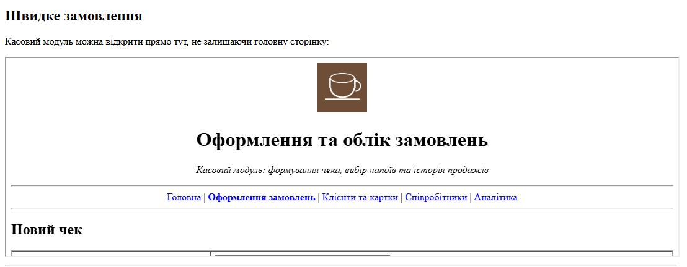

*Рисунок 3.6 - Сторінка замовлень усередині фрейму на головній сторінці*

Сторінки замовлень, клієнтів і персоналу містять форми: випадаючі списки <select>, поля <input> типів text, tel, email, number і checkbox, підписи <label for> та кнопки трьох типів (button, submit, reset). Обов'язкові поля мають атрибут required. У цій роботі форми лише розмічені, обробку даних буде додано в лабораторній роботі №3. Для розміщення полів форм використано таблиці без рамки та з рамкою.

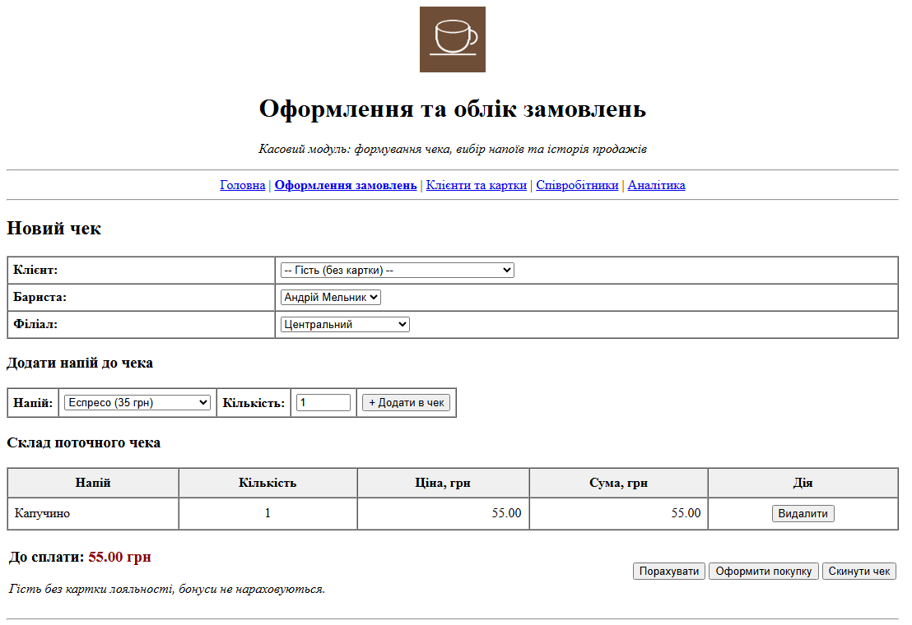

*Рисунок 3.7 - Форма нового чека на сторінці orders.html*

## 4 ПЕРЕЛІК ВИКОРИСТАНИХ ТЕГІВ І АТРИБУТІВ

**Таблиця 4.1 - Теги та атрибути HTML, використані в роботі**

| Тег / атрибут | Призначення | Де використано |
| --- | --- | --- |
| <header>, <nav>, <main>, <section>, <footer> | структурні блоки сторінки | усі сторінки |
| <h1>...<h6> | заголовки шести рівнів | h1-h3 усі сторінки, h4 новини і підвал, h5 підвал, h6 підпис цитати |
| <p>, <br>, <hr> | абзац, перенесення рядка, горизонтальна лінія | текстові блоки, новини, розділювачі |
| <blockquote> | цитата | цитата шеф-бариста (index.html) |
| <b>, <i>, <u>, <s> | жирний, курсив, підкреслення, закреслення | пропозиції тижня, назви, стара ціна |
| <big>, <small> | збільшений і зменшений шрифт | назва акційного напою, примітки, підвал |
| <sup>, <sub> | верхній і нижній індекси | кількість чашок (10 у степені 5), м², градуси, формула кофеїну |
| <font color> | колір тексту | нова ціна, статуси «Виконано», «Відсутня», «Вихідний» |
| <ul type> | маркерований список (square, circle) | сорти зерна, послуги для гостей |
| <ol type>, start | нумерований список (1, a, I), початковий номер | етапи капучино, розділи меню, правила програми |
| <dl>, <dt>, <dd> | список визначень | словник бариста |
| <a href>, target, title | гіперпосилання | меню, логотип, Вікіпедія, mailto, Google Maps |
|  (src, alt, width, height, border) | зображення | логотип, карта мережі |
| <map>, <area> (shape, coords, href, title), usemap | карта активних областей | карта мережі (rect, circle, poly, default) |
| <table>, <caption>, <thead>, <tbody>, <tr>, <th>, <td> | таблиці | філіали, чеки, клієнти, картки, бариста, звіти |
| rowspan, colspan | об'єднання комірок | дворівнева шапка і графік вихідних у таблиці філіалів |
| border, cellpadding, cellspacing, width, bgcolor, align | оформлення таблиць | усі таблиці, підсумки у звітах |
| <form>, <label>, <select>, <option>, <input>, <button> | елементи форм | чек, пошук, реєстрація клієнта, новий працівник, вибір звіту |
| <iframe> | вбудований фрейм | швидке замовлення на головній сторінці |

## ВИСНОВКИ

У лабораторній роботі створено сайт мережі кав'ярень «Coffee Shop» з п'яти сторінок, пов'язаних меню. Структура сайту повторює форми курсового застосунку CoffeeShopApp, а дані на сторінках узгоджені між собою і з таблицями бази даних coffeeshopdb.

На практиці використано заголовки всіх рівнів, теги форматування тексту, п'ять видів списків (зокрема вкладений список і продовження нумерації атрибутом start), таблиці з об'єднанням комірок по горизонталі та вертикалі, зображення-посилання, карту зображення з областями rect, circle, poly і default, плаваючий фрейм і форми. Оформлення поки що задано атрибутами HTML (align, bgcolor, border, font), у наступній роботі його буде перенесено в CSS.


---
---

# ЧАСТИНА 2. ЗВІТ ДЛЯ ЛАБОРАТОРНОЇ РОБОТИ №2 (CSS)

```text
МІНІСТЕРСТВО ОСВІТИ І НАУКИ УКРАЇНИ
УКРАЇНСЬКИЙ ДЕРЖАВНИЙ УНІВЕРСИТЕТ НАУКИ І ТЕХНОЛОГІЙ
Кафедра комп'ютерних інформаційних технологій
ЗВІТ
з лабораторної роботи №2
з дисципліни «Інтернет-програмування»
на тему: «Введення в CSS та блочна верстка (DIV-верстка)»
Виконала:
студентка групи ПЗ2313
Бондаренко Поліна Євгенівна
Перевірив:
доц. Андрющенко Вадим Олександрович
Дніпро 2026
```

**Тема: введення в CSS та блочна верстка (DIV-верстка).**

**Мета роботи: навчитися оформлювати веб-сторінки за допомогою каскадних таблиць стилів, винести все оформлення з HTML в окремий файл, побудувати макет сторінки з блоків, застосувати блокову модель, обтікання float, Flexbox і Grid, розібратися з каскадом і специфічністю селекторів.**

## 1 ПОСТАНОВКА ЗАВДАННЯ

У методичних вказівках розглянуто способи підключення CSS, синтаксис правил, селектори тегів, класів та ідентифікаторів і приклад блочної верстки стрічки новин: блоки div з класами, обтікання float для дати й джерела та скидання обтікання через overflow: hidden. У лекції 2 наголошено, що HTML має відповідати лише за структуру і не містити стильової інформації, а також розглянуто семантичні теги HTML5, каскад і специфічність, блокову модель, Flexbox, Grid і змінні CSS.

Завдання роботи: оформити сайт «Coffee Shop» з лабораторної роботи №1 за допомогою CSS, прибрати з розмітки атрибути оформлення та побудувати макет сторінок з блоків.

## 2 ХІД ВИКОНАННЯ РОБОТИ

### 2.1 Підключення стилів

Усі стилі зібрано в одному файлі style.css, який підключено в <head> кожної з п'яти сторінок тегом <link rel="stylesheet">. Зовнішній файл обрано тому, що зміна в ньому одразу діє на весь сайт, а браузер завантажує його один раз і далі бере з кешу. Атрибутів style та блоків <style> у сторінках немає. Також додано мета-тег viewport, без якого телефон показує сторінку зменшеною копією настільної версії і медіазапити не працюють.

**Лістинг 2.1 - Заголовна частина сторінки index.html**

```html
<head>
    <meta charset="UTF-8">
    <meta name="viewport" content="width=device-width, initial-scale=1">
    <title>Coffee Shop - Головна</title>
    <link rel="stylesheet" href="style.css">
</head>
```

### 2.2 Перенесення оформлення з HTML у CSS

Спочатку з розмітки ЛР1 прибрано все, що відповідало за вигляд: атрибути align, bgcolor, border, cellpadding, cellspacing, width, type у списків і теги <font>, <big>. Замість них елементам дано класи, а оформлення описано в style.css (таблиця 2.1). Теги <b>, <i>, <u>, <s>, <small>, <sup>, <sub> залишено, бо вони передають зміст тексту (наголос, стара ціна, індекс у формулі). Атрибути width і height залишено тільки в зображення карти: координати областей <area> задаються в пікселях, тому розмір картинки має бути фіксованим.

**Таблиця 2.1 - Заміна атрибутів оформлення на класи CSS**

| Було в ЛР1 | Стало в ЛР2 | Правило CSS |
| --- | --- | --- |
| <nav align="center">, <div align="center"> | <nav class="main-nav"> зі списком <ul> | display: flex для .main-nav ul, .site-header |
| <b><a href="index.html"> | <a class="active"> | .main-nav a.active |
| <font color="green"> | <span class="status-ok"> | .status-ok { color: var(--green) } |
| <font color="#B22222"><b>70 грн</b></font> | <span class="price-new"> | .price-new |
| <big><b>Лавандовий раф</b></big> | заголовок <h3> у картці | .offer-card h3 |
| <h6 align="right"> | <h6 class="quote-author"> | text-align: right |
| <ul type="square">, <ol type="I"> | class="list-square", class="list-roman" | list-style-type |
| <table border="1" cellpadding="8" cellspacing="0" width="100%"> | <table class="data-table"> | border-collapse, padding, width |
| <tr bgcolor="#fff3cd"> | <tr class="subtotal"> | table.data-table tbody tr.subtotal |
| <td align="center">, <td align="right"> | class="center", class="num" | text-align |
| форми в таблицях без рамки | <fieldset>, <legend>, <div class="form-row"> | .form-row { display: flex } |
| <iframe width height frameborder> | <iframe class="frame"> | .frame |

**Лістинг 2.2 - Підсумковий рядок звіту в ЛР1 (analytics.html)**

```html
<tr bgcolor="#fff3cd">
    <td><b>Центральний (разом)</b></td>
    <td><b>Усі напої</b></td>
    <td align="center"><b>240</b></td>
    <td align="right"><b>13 690.00</b></td>
</tr>
```

**Лістинг 2.3 - Той самий рядок у ЛР2 (analytics.html)**

```html
<tr class="subtotal">
    <td>Центральний (разом)</td>
    <td>Усі напої</td>
    <td class="center">240</td>
    <td class="num">13 690.00</td>
</tr>
```

### 2.3 Блочна верстка головної сторінки

Головну сторінку зібрано з блоків так само, як у прикладі з методички. Загальний контейнер .container має максимальну ширину 1100 px і вирівнюється по центру за рахунок margin: 0 auto. Усередині нього розміщено шапку, меню, блок .layout з двома колонками і підвал. Ліва колонка main.content займає 66% ширини і має float: left, права aside.sidebar займає 31% і має float: right. Щоб підвал не заходив під колонки, у блоку .layout задано overflow: hidden: так само в методичці працює клас .bottom_div.

**Лістинг 2.4 - Каркас головної сторінки (вміст блоків пропущено)**

```html
<div class="container">
    <header class="site-header"> ... </header>
    <nav class="main-nav"> ... </nav>

    <!-- дві колонки: основний вміст (float: left) і новини (float: right) -->
    <div class="layout">
        <main class="content"> ... </main>
        <aside class="sidebar"> ... </aside>
    </div>

    <footer class="site-footer"> ... </footer>
</div>
```

**Лістинг 2.5 - Стилі двох колонок (style.css)**

```css
/* головна сторінка: дві колонки на float.
   overflow: hidden скидає обтікання, як .bottom_div у методичці */
.layout {
    overflow: hidden;
}

.content {
    float: left;
    width: 66%;
}

.sidebar {
    float: right;
    width: 31%;
    margin-top: 28px;
}
```

Бічна колонка містить стрічку новин. Кожна новина побудована за схемою з методички, тільки замість окремих div для заголовка і тексту використано семантичні теги <h4> і <p>, а саму новину обгорнуто в <article>, як радить лекція 2. Відповідність класів наведено в таблиці 2.2.

**Таблиця 2.2 - Відповідність класів прикладу з методички і проєкту**

| Методичка | Проєкт | Призначення |
| --- | --- | --- |
| .container_div | .container | загальний контейнер по центру сторінки |
| .head_div | .site-header | шапка з назвою |
| .main_div | .content | колонка з основним вмістом |
| .element_div | .news-item | блок однієї новини |
| .news_header_div | .news-title | заголовок новини |
| .news_info_div | .news-text | текст новини |
| .post_time_div | .news-time | дата публікації (float: left) |
| .news_source_div | .news-source | джерело новини (float: right) |
| .bottom_div | .news-bottom | рядок з датою і джерелом, скидає обтікання (overflow: hidden) |

**Лістинг 2.6 - Розмітка однієї новини (index.html)**

```html
<article class="news-item">
    <h4 class="news-title">Відкрили літню терасу на Подолі</h4>
    <p class="news-text">На Контрактовій площі запрацювала тераса на 20 місць. Вона буде відкрита до перших холодів.</p>
    <div class="news-bottom">
        <div class="news-time"><time datetime="2026-09-12">12.09.2026</time></div>
        <div class="news-source">адміністрація мережі</div>
    </div>
</article>
```

**Лістинг 2.7 - Стилі стрічки новин (style.css)**

```css
/* ---------- 7. Новини: DIV-верстка за прикладом з методички ---------- */

/* блок однієї новини (аналог .element_div) */
.news-item {
    margin-bottom: 12px;
    padding: 14px 16px;
    background-color: #f4efe8;
    border: 1px solid var(--line);
    border-radius: 4px;
}

/* заголовок новини (аналог .news_header_div) */
.news-title {
    margin: 0 0 6px;
    font-size: 16px;
}

/* текст новини (аналог .news_info_div) */
.news-text {
    margin: 0;
    color: #404040;
}

/* нижній рядок: дата зліва, джерело справа */
.news-bottom {
    overflow: hidden;
    margin-top: 8px;
    color: #888888;
    font-size: 12px;
}

.news-time {
    float: left;
}

.news-source {
    float: right;
}
```


*Рисунок 2.1 - Головна сторінка до підключення стилів (ЛР1)*

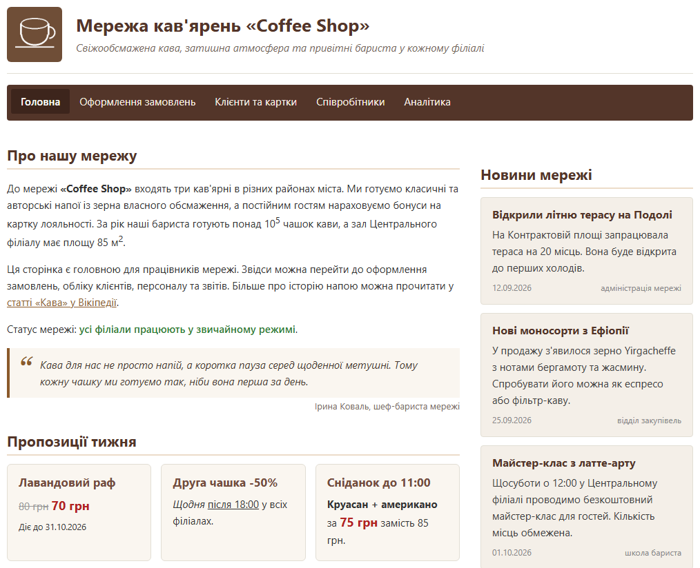

*Рисунок 2.2 - Головна сторінка після підключення style.css*

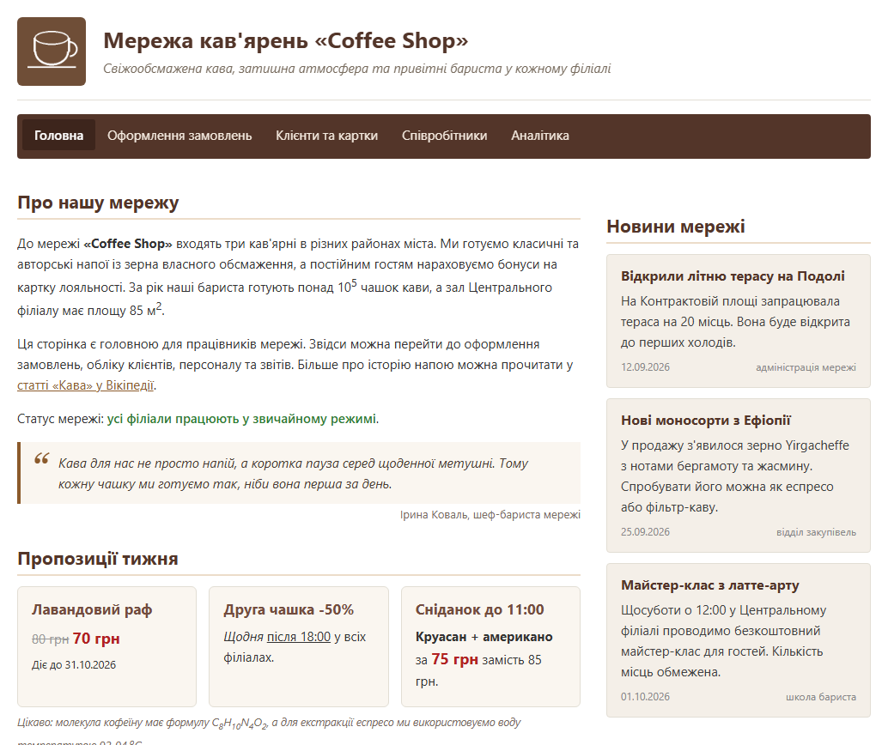

*Рисунок 2.3 - Дві колонки: основний вміст і стрічка новин*

### 2.4 Flexbox і Grid

Обтікання float зручне для двох колонок, але для дрібніших елементів використано сучасні способи розкладки з лекції 2. Flexbox (одновимірна модель) розкладає в рядок логотип і назву в шапці, пункти меню, підпис і поле в рядках форм, елементи панелі пошуку, суму і кнопки в підсумку чека та колонки підвалу. Grid (двовимірна модель) використано для трьох карток «Пропозиції тижня» (grid-template-columns: repeat(3, 1fr)) і для чотирьох списків розділу меню, розкладених у дві колонки.

**Лістинг 2.8 - Flexbox для шапки та меню, Grid для карток і списків (style.css)**

```css
/* шапка: логотип і назва в один рядок (flexbox) */
.site-header {
    display: flex;
    align-items: center;
    gap: 20px;
    padding-bottom: 16px;
    border-bottom: 1px solid var(--line);
}

.main-nav ul {
    display: flex;
    flex-wrap: wrap;
    margin: 0;
    padding: 6px;
    list-style: none;
}

/* ---------- 5. Картки пропозицій (CSS Grid) ---------- */
.offers {
    display: grid;
    grid-template-columns: repeat(3, 1fr);
    gap: 14px;
}

/* два списки поруч */
.two-columns {
    display: grid;
    grid-template-columns: 1fr 1fr;
    gap: 0 28px;
}
```

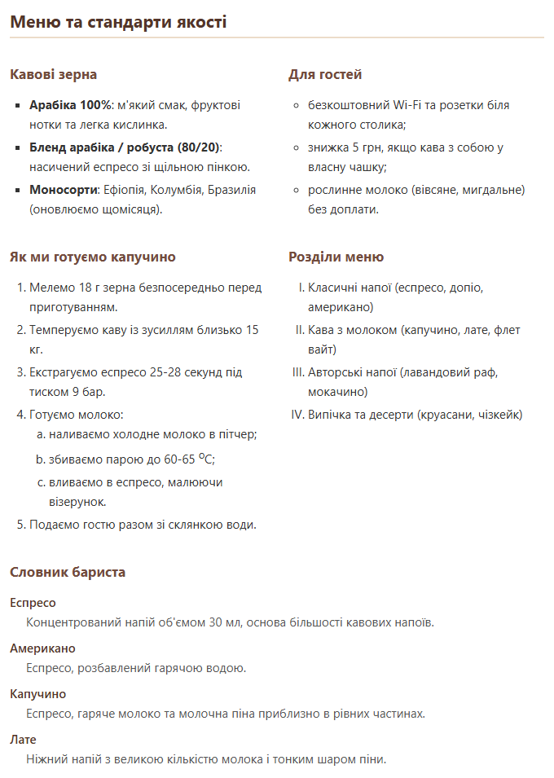

*Рисунок 2.4 - Списки в дві колонки (Grid)*

### 2.5 Блокова модель

Кожен елемент браузер розглядає як прямокутник з чотирьох шарів: вміст (content), внутрішній відступ (padding), рамка (border) і зовнішній відступ (margin). Для всіх елементів задано box-sizing: border-box, тому значення width включає padding і border. Наприклад, блок новини .news-item має padding: 14px 16px, рамку 1 px і margin-bottom: 12px. Внутрішня ширина контейнера дорівнює 1100 - 2 * 32 - 2 * 1 = 1034 px, бічна колонка займає 31% від неї, тобто приблизно 320 px. Оскільки padding і рамка входять у цю ширину, на текст новини залишається 320 - 2 * 16 - 2 * 1 = 286 px, і колонка не виходить за межі макета.

**Лістинг 2.9 - Модель border-box (style.css)**

```css
/* ширина блоку враховує padding і border */
* {
    box-sizing: border-box;
}
```

### 2.6 Селектори, каскад і специфічність

У файлі стилів використано різні види селекторів (таблиця 2.3).

**Таблиця 2.3 - Види селекторів у style.css**

| Вид селектора | Приклад | Призначення |
| --- | --- | --- |
| тег | body, h2, fieldset | базовий шрифт, фон, заголовки |
| клас | .container, .btn, .news-item | більшість правил проєкту |
| ідентифікатор | #lbl-total | велика сума до сплати в чеку |
| нащадок | .main-nav a, .offer-card h3 | посилання меню, заголовок картки |
| дочірній елемент | .form-row > label:first-child | підпис поля фіксованої ширини |
| сусідній елемент | .data-table thead tr + tr th | другий рядок дворівневої шапки |
| атрибут | input[type="text"], th[colspan] | поля форм, заголовок над кількома стовпцями |
| псевдоклас | :hover, :focus, :nth-child(even), :root | наведення, фокус, «зебра», змінні |
| псевдоелемент | blockquote::before | велика лапка перед цитатою |
| групування | h1, h2, h3, h4, h5, h6 | спільний колір заголовків |

Під час оформлення таблиць звітів виникла ситуація, яка добре показує роботу каскаду. Правило «зебри» .data-table tbody tr:nth-child(even) має специфічність (0,2,2): клас, псевдоклас і два теги. Селектор .data-table tbody tr.subtotal для підсумкового рядка має таку саму вагу, а при однаковій вазі перемагає правило, записане у файлі пізніше. Через це підсумковий рядок на парній позиції міг отримати колір зебри замість жовтого. Щоб результат не залежав від порядку правил, у селектор додано тег table: table.data-table tbody tr.subtotal має специфічність (0,2,3) і перемагає і «зебру», і :hover. Схожа ситуація була з вирівнюванням заголовків: правило .data-table th (0,1,1) сильніше за .center (0,1,0), тому для таблиць додано правила .data-table .center і .data-table .num з вагою (0,2,0).

**Лістинг 2.10 - Правила таблиць (style.css)**

```css
/* "зебра" та підсвічування рядка під курсором */
.data-table tbody tr:nth-child(even) {
    background-color: #faf8f5;
}

.data-table tbody tr:hover {
    background-color: #f2eee7;
}

/* підсумкові рядки звітів. Селектор table.data-table має специфічність (0,2,3),
   тому перемагає "зебру" та :hover зі специфічністю (0,2,2) */
table.data-table tbody tr.subtotal {
    background-color: #fff3cd;
    font-weight: 600;
}

table.data-table tbody tr.cube-total {
    background-color: #d1ecf1;
}

table.data-table tbody tr.grand-total {
    background-color: #d4edda;
    font-weight: 700;
}

.center {
    text-align: center;
}

.num {
    text-align: right;
    white-space: nowrap;
}

/* для заголовків таблиці потрібна більша специфічність,
   ніж у .data-table th (0,1,1), інакше вирівнювання не спрацює */
.data-table .center {
    text-align: center;
}

.data-table .num {
    text-align: right;
}

/* не переносити телефони та години роботи */
.nowrap {
    white-space: nowrap;
}
```

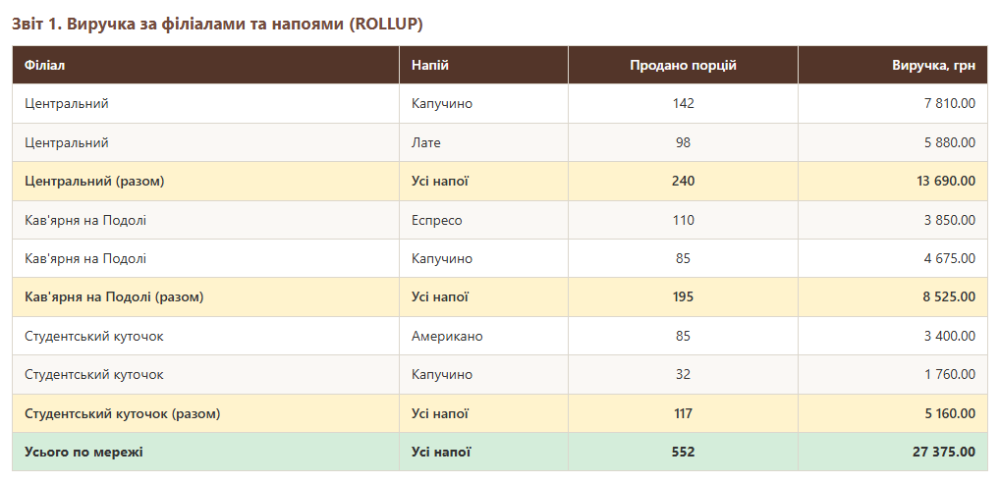

*Рисунок 2.5 - Звіт ROLLUP: зебра, проміжні та загальний підсумки*

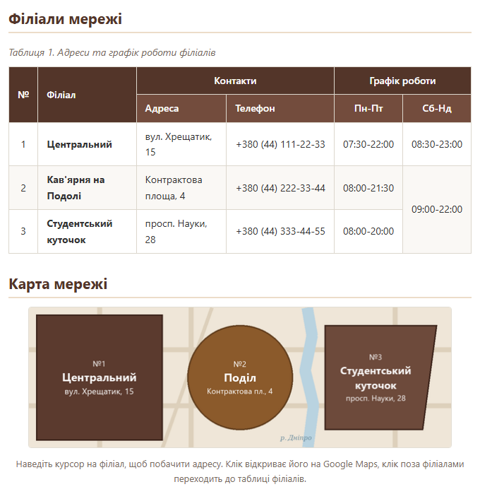

*Рисунок 2.6 - Таблиця філіалів і карта мережі*

### 2.7 Змінні CSS і псевдоелементи

Кольори фірмової палітри винесено у змінні в правилі :root, а в інших правилах вони підставляються через var(). Якщо потрібно змінити, наприклад, основний коричневий колір, достатньо виправити одне значення. Перед цитатою псевдоелемент ::before малює велику лапку, тому в HTML для неї не потрібен окремий тег.

**Лістинг 2.11 - Змінні та псевдоелемент (style.css)**

```css
:root {
    --coffee-dark: #3d251c;
    --coffee: #533529;
    --coffee-medium: #734c3d;
    --caramel: #8b5a2b;
    --cream: #f7f4ee;
    --cream-light: #faf6f0;
    --line: #e2ded4;
    --text: #333333;
    --text-light: #776b5d;
    --green: #2e7d32;
    --red: #c93b2b;
    --radius: 6px;
}

/* велика лапка перед цитатою (псевдоелемент) */
blockquote::before {
    content: "\201C";
    position: absolute;
    left: 12px;
    top: -6px;
    color: var(--caramel);
    font-family: Georgia, serif;
    font-size: 48px;
}
```

### 2.8 Форми

Форми переведено з табличної розкладки на блоки: поля згруповано тегом <fieldset> з підписом <legend>, кожна пара «підпис + поле» лежить у <div class="form-row">, який розкладається через Flexbox. Поля мають однакову рамку і заокруглення, а при фокусі рамка змінює колір і з'являється тінь (:focus). Кнопки оформлено класами .btn, .btn-light, .btn-grey, .btn-remove.

**Лістинг 2.12 - Рядок форми та поля введення (style.css)**

```css
/* рядок форми: підпис і поле поруч */
.form-row {
    display: flex;
    flex-wrap: wrap;
    align-items: center;
    gap: 10px;
    margin-bottom: 10px;
}

.form-row > label:first-child {
    width: 120px;
    font-weight: 600;
}

input[type="text"],
input[type="tel"],
input[type="email"],
input[type="number"],
select {
    padding: 6px 10px;
    background-color: #ffffff;
    border: 1px solid #c9c3b8;
    border-radius: 4px;
    font-family: inherit;
    font-size: 14px;
}

input[type="text"],
input[type="tel"],
input[type="email"] {
    width: 280px;
}

select {
    min-width: 280px;
}

input[type="number"] {
    width: 80px;
}
```

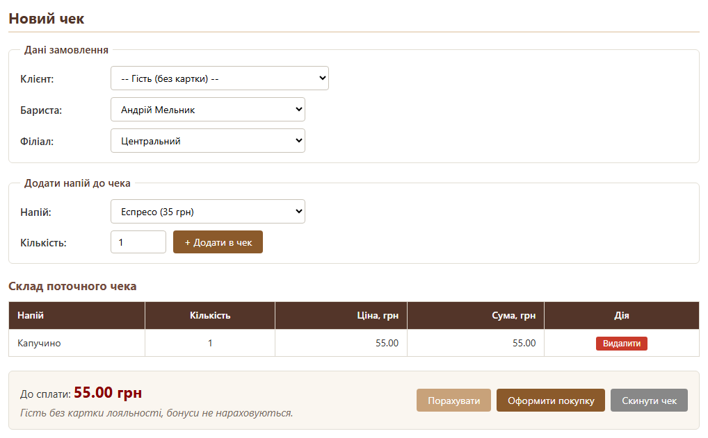

*Рисунок 2.7 - Форма нового чека на сторінці orders.html*

### 2.9 Адаптивність

Для вузьких екранів додано два медіазапити. При ширині до 900 px колонки скасовують обтікання і стають одна під одною, картки й списки вишиковуються в одну колонку. При ширині до 600 px шапка і меню перебудовуються вертикально, а поля форм розтягуються на всю ширину. Зображення карти не масштабується, бо інакше координати областей перестануть збігатися з малюнком, тому для нього задано горизонтальну прокрутку overflow-x: auto.

**Лістинг 2.13 - Медіазапити (style.css)**

```css
/* ---------- 14. Адаптивність ---------- */

/* планшет: колонки одна під одною */
@media (max-width: 900px) {
    .content,
    .sidebar {
        float: none;
        width: auto;
    }

    .offers,
    .two-columns {
        grid-template-columns: 1fr;
    }
}

/* телефон */
@media (max-width: 600px) {
    body {
        padding: 0;
    }

    .container {
        padding: 16px;
        border-radius: 0;
    }

    .site-header {
        flex-direction: column;
        text-align: center;
    }

    .main-nav ul {
        flex-direction: column;
    }

    .form-row > label:first-child {
        width: 100%;
    }

    input[type="text"],
    input[type="tel"],
    input[type="email"],
    select {
        width: 100%;
        min-width: 0;
    }

    .data-table {
        font-size: 12px;
    }
}
```

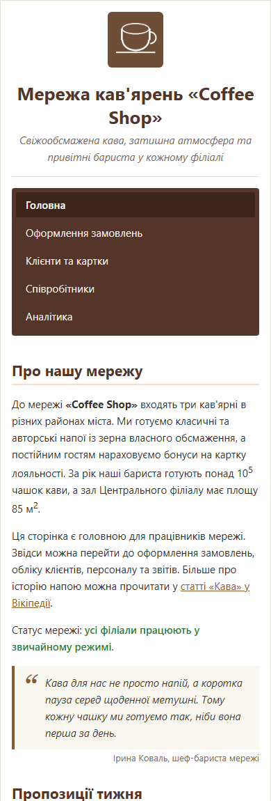

*Рисунок 2.8 - Головна сторінка на екрані телефона (390 px)*

## ВИСНОВКИ

У лабораторній роботі сайт «Coffee Shop» оформлено за допомогою одного зовнішнього файлу style.css. З HTML прибрано атрибути оформлення та теги <font> і <big>, замість них використано класи. Головну сторінку зібрано з блоків: дві колонки на float зі скиданням обтікання через overflow, стрічка новин за схемою з методички. Для дрібніших елементів застосовано Flexbox і Grid, кольори винесено у змінні CSS.

На практиці розібрано блокову модель і box-sizing, каскад і специфічність селекторів (зокрема, чому правило «зебри» перекривало колір підсумкових рядків), псевдокласи і псевдоелементи, а також медіазапити для телефонів.


---
---

# ЧАСТИНА 3. ЗВІТ ДЛЯ ЛАБОРАТОРНОЇ РОБОТИ №3 (JAVASCRIPT)

```text
МІНІСТЕРСТВО ОСВІТИ І НАУКИ УКРАЇНИ
УКРАЇНСЬКИЙ ДЕРЖАВНИЙ УНІВЕРСИТЕТ НАУКИ І ТЕХНОЛОГІЙ
Кафедра комп'ютерних інформаційних технологій
ЗВІТ
з лабораторної роботи №3
з дисципліни «Інтернет-програмування»
на тему: «Основи мови JavaScript та маніпуляція об'єктною моделлю документа (DOM)»
Виконала:
студентка групи ПЗ2313
Бондаренко Поліна Євгенівна
Перевірив:
доц. Андрющенко Вадим Олександрович
Дніпро 2026
```

**Тема: основи мови JavaScript та маніпуляція об'єктною моделлю документа (DOM).**

**Мета роботи: навчитися зберігати дані сторінки в масивах об'єктів JavaScript і будувати з них таблиці через DOM, обробляти події користувача, перевіряти дані форм, сортувати й фільтрувати записи без перезавантаження сторінки та безпечно виводити введений користувачем текст.**

## 1 ПОСТАНОВКА ЗАВДАННЯ

У методичних вказівках розібрано приклад таблиці книг: записи створюються функцією-конструктором і зберігаються в масиві, таблиця будується методами createElement, createTextNode і appendChild, а клік по заголовку стовпця сортує записи функцією quickSort. Повторний клік по тому ж стовпцю не сортує масив заново, а виводить його у зворотному порядку (функція allocator).

У лекції 3 розглянуто змінні let і const, функції та стрілкові функції, пошук елементів (getElementById, querySelector), створення й видалення вузлів, різницю між textContent та innerHTML (ризик XSS), керування класами через classList, події, делегування подій і preventDefault.

Завдання роботи: додати до сайту «Coffee Shop» з лабораторної роботи №2 клієнтську логіку на чистому JavaScript без сторонніх бібліотек.

## 2 ХІД ВИКОНАННЯ РОБОТИ

### 2.1 Підключення скриптів

Для кожної сторінки написано окремий файл (таблиця 2.1). Скрипт підключено в <head> з атрибутом defer: браузер завантажує файл паралельно з розбором HTML, а виконує його тільки після того, як DOM побудовано. Тому скрипти одразу звертаються до елементів сторінки і не потребують обробника DOMContentLoaded.

**Лістинг 2.1 - Підключення скрипту (orders.html)**

```html
<head>
    <meta charset="UTF-8">
    <meta name="viewport" content="width=device-width, initial-scale=1">
    <title>Coffee Shop - Оформлення замовлень</title>
    <link rel="stylesheet" href="style.css">
    <script src="orders.js" defer></script>
</head>
```

**Таблиця 2.1 - Файли скриптів**

| Файл | Сторінка | Що робить |
| --- | --- | --- |
| main.js | index.html | годинник у шапці, підсвічування вечірньої акції після 18:00 |
| orders.js | orders.html | склад чека з масиву, підсумок і бонуси, видалення позицій, проведення чека, історія чеків |
| customers.js | customers.html | таблиці клієнтів і карток з масивів, пошук з підсвічуванням, перевірка й реєстрація клієнта |
| baristas.js | baristas.html | таблиця з масиву, сортування кліком по заголовку, фільтр за філіалом, додавання працівника |
| analytics.js | analytics.html | перемикання звітів, рядок стану з кількістю рядків |

До style.css додано кілька класів, якими керує JavaScript: .hidden (приховати блок), .promo-active (активна акція), .sort-asc і .sort-desc (стрілка сортування), .invalid (поле з помилкою), .form-message (повідомлення під формою). Скрипти не змінюють стилі напряму, а лише додають і прибирають класи через classList.

### 2.2 Головна сторінка: годинник і акція

Функція updateClock створює об'єкт Date, форматує дату і час методами toLocaleDateString та toLocaleTimeString для локалі uk-UA і записує результат у тег <time>. Функція викликається одразу і далі щосекунди через setInterval. Заодно вона перевіряє годину: з 18:00 картці акції «Друга чашка -50%» додається клас promo-active, і картка підсвічується.

**Лістинг 2.2 - Файл main.js**

```javascript
// main.js - головна сторінка: годинник у шапці та стан вечірньої акції.
// Скрипт підключено з атрибутом defer, тому DOM уже побудований.

const clock = document.getElementById('clock');
const promoCard = document.getElementById('evening-promo');
const promoState = document.getElementById('promo-state');

const PROMO_START_HOUR = 18; // "друга чашка -50%" діє з 18:00

function updateClock() {
    const now = new Date();

    const date = now.toLocaleDateString('uk-UA', {
        weekday: 'long',
        day: 'numeric',
        month: 'long',
        year: 'numeric'
    });
    const time = now.toLocaleTimeString('uk-UA');

    clock.textContent = date + ', ' + time;
    clock.setAttribute('datetime', now.toISOString());

    // вмикаємо або вимикаємо підсвічування акції
    if (now.getHours() >= PROMO_START_HOUR) {
        promoCard.classList.add('promo-active');
        promoState.textContent = 'Акція діє зараз!';
    } else {
        promoCard.classList.remove('promo-active');
        const hoursLeft = PROMO_START_HOUR - now.getHours();
        promoState.textContent = 'Почнеться о 18:00 (приблизно через ' + hoursLeft + ' год.)';
    }
}

updateClock();
setInterval(updateClock, 1000);
```

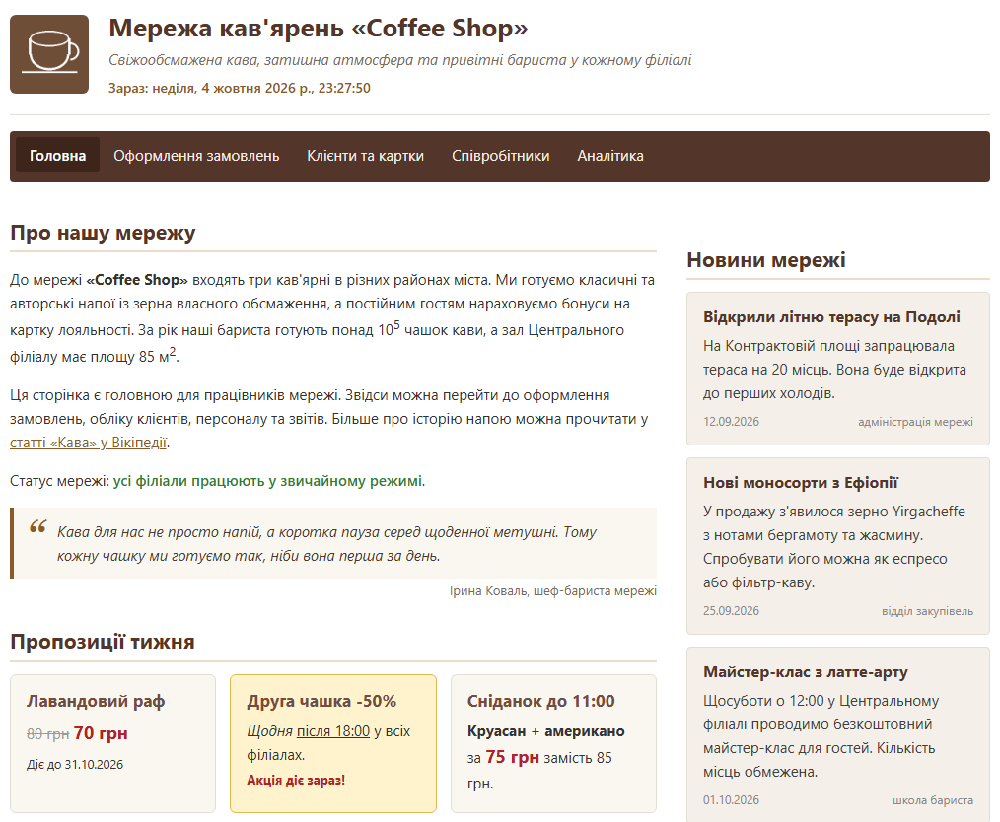

*Рисунок 2.1 - Годинник у шапці та активна вечірня акція*

### 2.3 Касовий модуль

На відміну від ЛР2, рядки чека і таблиці останніх чеків більше не записані в HTML. Дані зберігаються в масивах об'єктів orderItems і orders, а функції renderItems і renderOrders щоразу очищають <tbody> і будують рядки заново. Комірки створює допоміжна функція createCell, яка записує текст через textContent.

**Лістинг 2.3 - Дані касового модуля (orders.js)**

```javascript
const BONUS_PERCENT = 0.1; // кешбек 10% на картку лояльності

// позиції поточного чека
let orderItems = [
    { name: 'Капучино', price: 55, qty: 1 }
];

// проведені за сьогодні чеки (новіші на початку масиву)
const orders = [
    { id: 103, time: '10:05', shop: 'Студентський куточок', barista: 'Сергій Ткаченко', customer: 'Марія Шевченко', total: 125 },
    { id: 102, time: '09:40', shop: "Кав'ярня на Подолі", barista: 'Олена Бойко', customer: 'Гість', total: 40 },
    { id: 101, time: '09:15', shop: 'Центральний', barista: 'Андрій Мельник', customer: 'Олександр Коваленко', total: 90 }
];
let nextOrderId = 104;
```

**Лістинг 2.4 - Побудова таблиці чека (orders.js)**

```javascript
function renderItems() {
    itemsBody.innerHTML = ''; // очищаємо старі рядки

    if (orderItems.length === 0) {
        const tr = document.createElement('tr');
        tr.className = 'empty-row';
        const td = createCell('Чек порожній. Додайте напій зі списку вище.');
        td.colSpan = 5;
        tr.appendChild(td);
        itemsBody.appendChild(tr);
    }

    orderItems.forEach(function (item, index) {
        const tr = document.createElement('tr');
        tr.appendChild(createCell(item.name));
        tr.appendChild(createCell(item.qty, 'center'));
        tr.appendChild(createCell(formatMoney(item.price), 'num'));
        tr.appendChild(createCell(formatMoney(item.price * item.qty), 'num'));

        // кнопка видалення знає індекс свого рядка в масиві
        const tdButton = document.createElement('td');
        tdButton.className = 'center';
        const button = document.createElement('button');
        button.type = 'button';
        button.className = 'btn-remove';
        button.textContent = 'Видалити';
        button.dataset.index = index;
        tdButton.appendChild(button);
        tr.appendChild(tdButton);

        itemsBody.appendChild(tr);
    });

    updateTotal();
}
```

Кнопка «+ Додати в чек» зчитує вибраний напій і кількість. Кількість перевіряється (ціле число від 1 до 50), а якщо такий напій уже є в чеку, метод find знаходить його і збільшує кількість замість нового рядка. Сума чека рахується з масиву, кешбек дорівнює 10% суми з округленням Math.round, як і в курсовому застосунку. Для правильного закінчення слова (1 бонус, 2 бонуси, 12 бонусів) написано функцію bonusWord.

**Лістинг 2.5 - Додавання напою (orders.js)**

```javascript
// додавання напою в чек
addButton.addEventListener('click', function () {
    const option = drinkSelect.options[drinkSelect.selectedIndex];
    const qty = parseInt(qtyInput.value, 10);

    if (isNaN(qty) || qty < 1 || qty > 50) {
        showMessage('Кількість має бути цілим числом від 1 до 50.', true);
        qtyInput.classList.add('invalid');
        qtyInput.focus();
        return;
    }
    qtyInput.classList.remove('invalid');

    const name = option.dataset.name;
    const price = Number(option.value);

    // якщо такий напій уже є в чеку, збільшуємо кількість
    const existing = orderItems.find(function (item) {
        return item.name === name;
    });
    if (existing) {
        existing.qty += qty;
    } else {
        orderItems.push({ name: name, price: price, qty: qty });
    }

    qtyInput.value = 1;
    showMessage('', false);
    renderItems();
});
```

Кнопки «Видалити» створюються динамічно, тому обробник призначено не кожній кнопці, а одному елементу <tbody> (делегування подій). Подія кліку спливає від кнопки до <tbody>, у event.target лежить натиснута кнопка, а її атрибут data-index вказує, який елемент масиву видалити методом splice.

**Лістинг 2.6 - Видалення позиції через делегування подій (orders.js)**

```javascript
// видалення позиції: один обробник на весь tbody (делегування подій)
itemsBody.addEventListener('click', function (event) {
    if (event.target.classList.contains('btn-remove')) {
        const index = Number(event.target.dataset.index);
        orderItems.splice(index, 1);
        renderItems();
    }
});
```

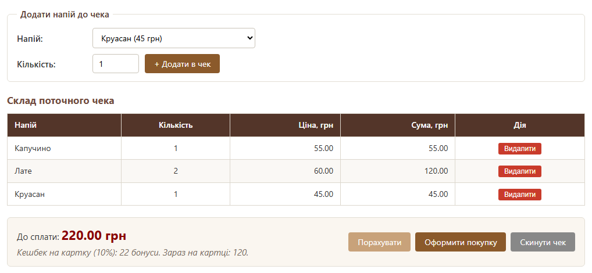

*Рисунок 2.2 - Чек з трьома позиціями та кешбеком для клієнта з карткою*

При відправленні форми preventDefault скасовує перезавантаження сторінки. Якщо чек порожній, виводиться повідомлення про помилку. Інакше створюється об'єкт нового чека, який методом unshift додається на початок масиву orders. Якщо в клієнта є картка, бонуси додаються до значення data-bonuses і оновлюється текст у списку клієнтів, тобто кешбек справді нараховується, а не лише показується.

**Лістинг 2.7 - Проведення чека (orders.js)**

```javascript
// оформлення покупки
orderForm.addEventListener('submit', function (event) {
    event.preventDefault(); // сторінка не перезавантажується

    if (orderItems.length === 0) {
        showMessage('Неможливо оформити порожній чек. Додайте хоча б один напій.', true);
        return;
    }

    const total = getTotal();
    const customer = getSelectedCustomer();
    const now = new Date();

    const order = {
        id: nextOrderId,
        time: now.toLocaleTimeString('uk-UA', { hour: '2-digit', minute: '2-digit' }),
        shop: shopSelect.options[shopSelect.selectedIndex].text,
        barista: baristaSelect.options[baristaSelect.selectedIndex].text,
        customer: customer.dataset.name,
        total: total
    };
    orders.unshift(order); // новий чек на початок списку
    nextOrderId++;

    let text = 'Чек №' + order.id + ' на суму ' + formatMoney(total) + ' грн проведено.';

    // нараховуємо бонуси на картку клієнта
    if (customer.dataset.card === 'true') {
        const bonus = Math.round(total * BONUS_PERCENT);
        const newBalance = Number(customer.dataset.bonuses) + bonus;
        customer.dataset.bonuses = newBalance;
        customer.textContent = customer.dataset.name + ' (картка: ' + newBalance + ' ' + bonusWord(newBalance) + ')';
        text += ' Нараховано ' + bonus + ' ' + bonusWord(bonus) + ', на картці тепер ' + newBalance + '.';
    }

    orderItems = [];
    renderItems();
    renderOrders();
    showMessage(text, false);
});
```

Окремо оброблено кнопку «Скинути чек». Подія reset спрацьовує до того, як поля форми повернуться до початкових значень, тому перемальовування чека відкладено через setTimeout з нульовою затримкою.

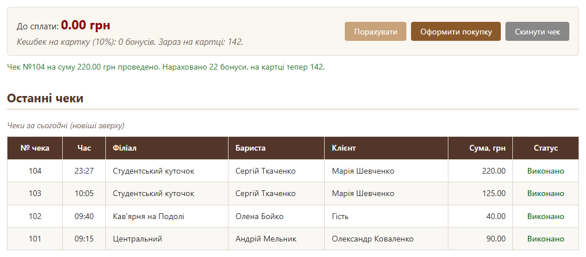

*Рисунок 2.3 - Повідомлення про проведений чек і новий рядок в історії*

### 2.4 Клієнти: пошук і реєстрація

Пошук працює на подію input, тобто після кожного введеного символу. Функція renderCustomers відбирає методом filter клієнтів, у яких ім'я, телефон або пошта містять рядок запиту, і показує лічильник «Показано N з M». Знайдений фрагмент підсвічується тегом <mark>: текст комірки ділиться на три частини, крайні вставляються як текстові вузли createTextNode, середня обгортається в <mark>. Через innerHTML це зробити простіше, але тоді введений у пошук HTML-код виконався б.

**Лістинг 2.8 - Підсвічування знайденого фрагмента (customers.js)**

```javascript
// комірка, у якій знайдений фрагмент обгорнуто тегом <mark>.
// Текст вставляється через createTextNode, тому HTML з поля пошуку не виконується
function createHighlightedCell(text, query) {
    const td = document.createElement('td');
    const position = text.toLowerCase().indexOf(query);

    if (query === '' || position === -1) {
        td.textContent = text;
        return td;
    }

    const mark = document.createElement('mark');
    mark.textContent = text.substring(position, position + query.length);

    td.appendChild(document.createTextNode(text.substring(0, position)));
    td.appendChild(mark);
    td.appendChild(document.createTextNode(text.substring(position + query.length)));
    return td;
}
```

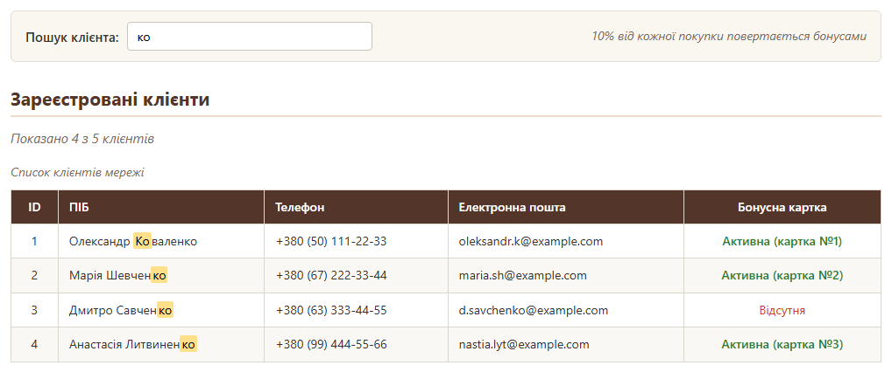

*Рисунок 2.4 - Пошук за фрагментом «ко» з підсвічуванням збігів*

Форма реєстрації перевіряє дані перед додаванням:

- ПІБ перевіряється регулярним виразом: щонайменше два слова з українських або латинських літер;
- телефон спочатку очищається від усього, крім цифр (replace(/\D/g, '')), допускаються формати +380XXXXXXXXX і 0XXXXXXXXX, після чого номер зводиться до вигляду +380 (XX) XXX-XX-XX;
- метод some перевіряє, чи немає вже клієнта з таким номером;
- правильність email перевіряє сам браузер завдяки type="email" і required.
**Лістинг 2.9 - Перевірка та форматування телефону (customers.js)**

```javascript
// +380501234567, 0501234567, +38 (050) 123-45-67 -> "+380 (50) 123-45-67"
function normalizePhone(value) {
    let digits = value.replace(/\D/g, ''); // залишаємо тільки цифри
    if (digits.length === 10 && digits[0] === '0') {
        digits = '38' + digits;
    }
    if (!/^380\d{9}$/.test(digits)) {
        return null;
    }
    return '+380 (' + digits.substring(3, 5) + ') ' + digits.substring(5, 8) + '-' +
        digits.substring(8, 10) + '-' + digits.substring(10);
}
```

Поле з помилкою отримує клас invalid (червона рамка), а під формою з'являється пояснення. Після успішної реєстрації клієнт отримує наступний вільний ID, а якщо стоїть позначка, то й картку з 10 стартовими бонусами в таблиці карток.

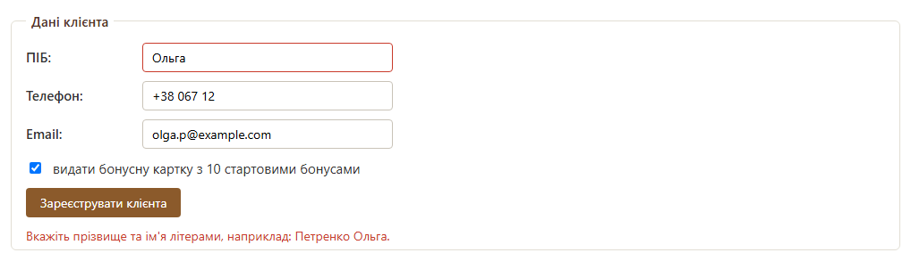

*Рисунок 2.5 - Помилка перевірки ПІБ*

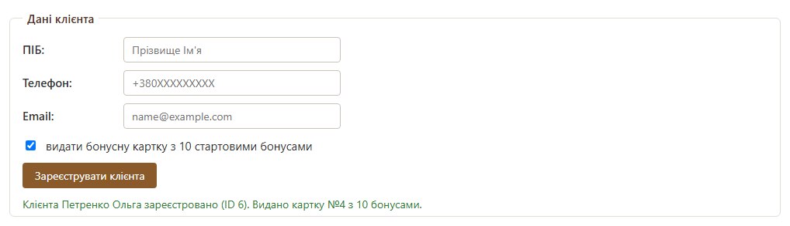

*Рисунок 2.6 - Повідомлення про реєстрацію клієнта*

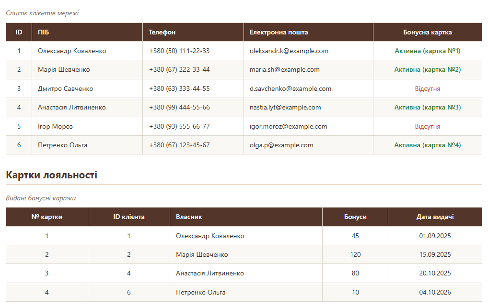

*Рисунок 2.7 - Новий клієнт і нова картка в таблицях*

### 2.5 Персонал: сортування за прикладом з методички

Сторінку персоналу зроблено за схемою прикладу з методички. Запис про працівника створює функція-конструктор Barista, записи зберігаються в масиві, а таблиця будується функцією renderTable. Відповідність частин прикладу і проєкту наведено в таблиці 2.2.

**Таблиця 2.2 - Порівняння з прикладом з методички**

| Методичка (таблиця книг) | Проєкт (таблиця бариста) |
| --- | --- |
| конструктор fillArray(years, books, authors) | конструктор Barista(id, name, phone, shop, shift, status) |
| масив txt | масив baristas |
| quickSort(l, h, type) з порівнянням isLow і вагами символів weight | quickSort(list, field) з функцією compare і localeCompare('uk') |
| allocator(arg): повторний клік виводить масив у зворотному порядку | sortBy(field): повторний клік викликає reverse() |
| createTable: createElement, createTextNode, appendChild | renderTable: createElement, textContent, appendChild |
| посилання javascript:allocator(...) у шапці | атрибут data-field у <th> і один обробник click на <thead> |

У методичці для правильного порядку кириличних літер написано окрему функцію weight, яка змінює коди символів. У проєкті цю задачу виконує метод localeCompare з локаллю uk: він знає порядок українського алфавіту, зокрема літер і, ї, є, ґ. Числові поля (ID) порівнюються відніманням, тому 10 стоїть після 9, а не після 1.

**Лістинг 2.10 - Конструктор і дані (baristas.js)**

```javascript
// конструктор запису (як BookItem / fillArray у методичці)
function Barista(id, name, phone, shop, shift, status) {
    this.id = id;
    this.name = name;
    this.phone = phone;
    this.shop = shop;
    this.shift = shift;
    this.status = status;
}

let baristas = [
    new Barista(1, 'Андрій Мельник', '+380 (67) 111-00-11', 'Центральний', 'Ранкова (07:30-15:00)', 'На зміні'),
    new Barista(2, 'Олена Бойко', '+380 (50) 222-00-22', "Кав'ярня на Подолі", 'Денна (10:00-18:00)', 'На зміні'),
    new Barista(3, 'Сергій Ткаченко', '+380 (63) 333-00-33', 'Студентський куточок', 'Повна (08:00-20:00)', 'На зміні'),
    new Barista(4, 'Юлія Кравчук', '+380 (97) 444-00-44', 'Центральний', 'Вечірня (15:00-22:00)', 'Вихідний'),
    new Barista(5, 'Богдан Лисенко', '+380 (66) 555-00-55', "Кав'ярня на Подолі", 'Вечірня (15:00-22:00)', 'Вихідний')
];
```

**Лістинг 2.11 - Швидке сортування і обробка повторного кліку (baristas.js)**

```javascript
// порівняння двох записів за полем: числа віднімаємо,
// рядки порівнюємо з урахуванням українського алфавіту
function compare(a, b, field) {
    if (typeof a[field] === 'number') {
        return a[field] - b[field];
    }
    return a[field].localeCompare(b[field], 'uk');
}

// швидке сортування: опорний елемент посередині, менші ліворуч, більші праворуч
function quickSort(list, field) {
    if (list.length <= 1) {
        return list;
    }

    const pivot = list[Math.floor(list.length / 2)];
    const less = [];
    const equal = [];
    const greater = [];

    list.forEach(function (item) {
        const result = compare(item, pivot, field);
        if (result < 0) {
            less.push(item);
        } else if (result > 0) {
            greater.push(item);
        } else {
            equal.push(item);
        }
    });

    return quickSort(less, field).concat(equal, quickSort(greater, field));
}

// як allocator() у методичці: повторний клік по тому ж стовпцю
// не сортує заново, а лише перевертає масив
function sortBy(field) {
    if (field === sortField) {
        baristas.reverse();
        sortAsc = !sortAsc;
    } else {
        baristas = quickSort(baristas, field);
        sortField = field;
        sortAsc = true;
    }
    updateHeaderArrows();
    renderTable();
}
```

Стрілка біля активного заголовка (▲ або ▼) малюється псевдоелементом ::after із CSS, а скрипт лише перемикає класи sort-asc і sort-desc. Обробник кліку висить на всій шапці таблиці: метод closest('th') знаходить заголовок, на якому клікнули, а dataset.field повідомляє, за яким полем сортувати. Фільтр за філіалом працює на подію change і застосовується разом із сортуванням.

**Лістинг 2.12 - Шапка таблиці (baristas.html) та обробник кліку (baristas.js)**

```html
<thead>
    <tr>
        <th class="center sortable" data-field="id">ID</th>
        <th class="sortable" data-field="name">ПІБ</th>
        <th>Телефон</th>
        <th class="sortable" data-field="shop">Філіал</th>
        <th class="sortable" data-field="shift">Зміна</th>
        <th class="sortable" data-field="status">Статус</th>
    </tr>
</thead>

// один обробник на всю шапку таблиці
tableHead.addEventListener('click', function (event) {
    const th = event.target.closest('th');
    if (th && th.dataset.field) {
        sortBy(th.dataset.field);
    }
});

filterShop.addEventListener('change', renderTable);
```

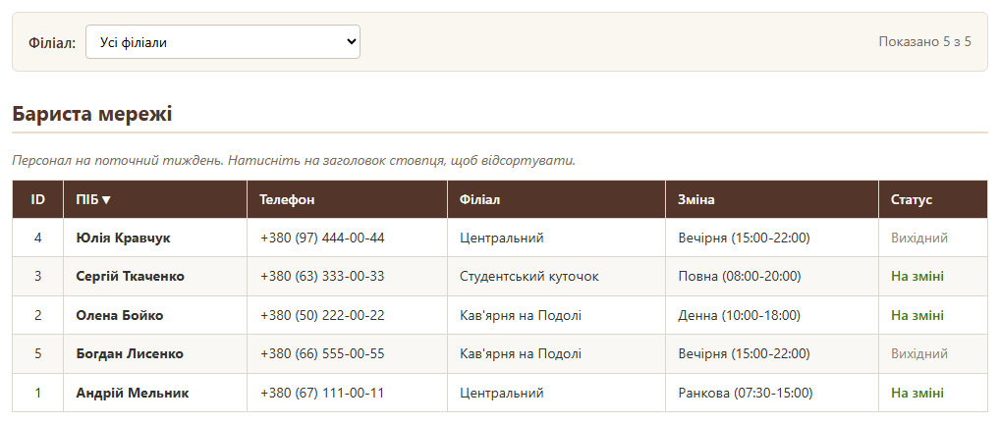

*Рисунок 2.8 - Таблиця бариста, відсортована за ПІБ у зворотному порядку*

### 2.6 Безпечне виведення даних

У всіх скриптах текст від користувача потрапляє на сторінку тільки через textContent або createTextNode. innerHTML використано лише для очищення <tbody> перед повторною побудовою (innerHTML = ''), де жодних даних немає. Для перевірки у форму нового працівника введено ім'я <i>Тест</i> Тестович. Теги показано як звичайний текст, курсив не застосувався (рисунок 2.9). Якби рядок вставлявся через innerHTML, браузер виконав би розмітку, а замість <i> зловмисник міг би вставити, наприклад,  зі своїм скриптом (XSS-атака).

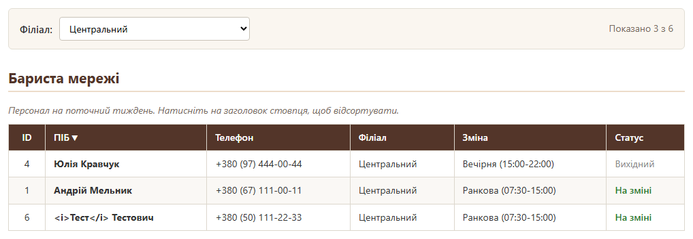

*Рисунок 2.9 - Фільтр «Центральний» і рядок з тегами, виведеними як текст*

### 2.7 Аналітика

Усі три звіти залишилися в HTML, а скрипт показує лише вибраний. Метод classList.toggle з другим аргументом додає клас hidden усім звітам, крім вибраного. Кількість рядків у рядку стану не записана вручну, а рахується через querySelectorAll('tbody tr'). Звіт перемикається і при зміні списку (подія change), і кнопкою «Сформувати».

**Лістинг 2.13 - Файл analytics.js**

```javascript
// analytics.js - перемикання аналітичних звітів без перезавантаження сторінки.
// Показується лише вибраний звіт, інші ховаються класом .hidden.

const reportSelect = document.getElementById('query-select');
const runButton = document.getElementById('btn-run-query');
const statusLine = document.getElementById('report-status');
const reports = document.querySelectorAll('.report');

function showReport() {
    const selected = 'section-' + reportSelect.value; // наприклад, section-rank
    let rowsCount = 0;

    reports.forEach(function (section) {
        const isSelected = section.id === selected;
        // toggle з другим аргументом: true - додати клас, false - прибрати
        section.classList.toggle('hidden', !isSelected);
        if (isSelected) {
            rowsCount = section.querySelectorAll('tbody tr').length;
        }
    });

    // назва звіту без номера на початку ("2. Рейтинг..." -> "Рейтинг...")
    const title = reportSelect.options[reportSelect.selectedIndex].text.replace(/^\d+\.\s*/, '');
    const time = new Date().toLocaleTimeString('uk-UA');
    statusLine.textContent = 'Сформовано звіт «' + title + '». Рядків: ' + rowsCount + '. Час: ' + time + '.';
}

reportSelect.addEventListener('change', showReport);
runButton.addEventListener('click', showReport);

showReport();
```

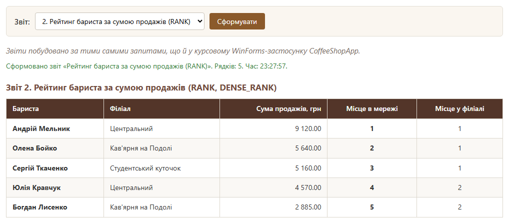

*Рисунок 2.10 - Вибрано звіт RANK, інші звіти приховано*

### 2.8 Перевірка роботи

Роботу скриптів перевірено в браузері Microsoft Edge. Помилок у консолі розробника на жодній зі сторінок немає. Перевірені сценарії наведено в таблиці 2.3.

**Таблиця 2.3 - Перевірка роботи скриптів**

| Дія | Очікуваний результат | Результат |
| --- | --- | --- |
| Вибрати клієнтку з карткою (120 бонусів) | текст «Кешбек на картку (10%): 6 бонусів» | збігається |
| Додати Лате x2, потім ще раз Капучино | сума 175 грн, потім Капучино x2 в одному рядку | збігається |
| Видалити позицію | рядок зникає, сума перераховується | збігається |
| Ввести кількість 0 | повідомлення «від 1 до 50», позиція не додається | збігається |
| Провести чек на 120 грн для клієнтки з карткою | чек №104 в історії, +12 бонусів, на картці 132 | збігається |
| Провести порожній чек | повідомлення про помилку | збігається |
| Пошук «шев» серед клієнтів | 1 рядок, фрагмент «Шев» підсвічено | збігається |
| Реєстрація з телефоном 067 123 45 67 | номер +380 (67) 123-45-67, ID 6, картка №4 | збігається |
| Повторна реєстрація з тим самим номером | повідомлення, що клієнт уже є | збігається |
| Клік по «ПІБ» двічі | спочатку А-Я, потім Я-А, стрілка змінюється | збігається |
| Клік по «ID» | порядок 1, 2, 3, 4, 5 (числове порівняння) | збігається |
| Фільтр «Центральний» | 2 з 5 працівників | збігається |
| Ім'я <i>Тест</i> Тестович | теги видно як текст | збігається |
| Вибрати звіт CUBE | видно лише звіт CUBE, у рядку стану 14 рядків | збігається |

### 2.9 Використані методи та події

**Таблиця 2.4 - Методи DOM і події, використані в роботі**

| Метод / подія | Де використано |
| --- | --- |
| getElementById, querySelector, querySelectorAll | пошук елементів на всіх сторінках |
| createElement, createTextNode, appendChild | побудова рядків таблиць, підсвічування <mark> |
| textContent | виведення всього тексту від користувача |
| classList.add, remove, toggle, contains | акція, стрілки сортування, .hidden, .invalid, кнопки «Видалити» |
| dataset (data-*) | індекс позиції в чеку, дані клієнта в <option>, поле сортування в <th> |
| closest | пошук заголовка <th>, на якому клікнули |
| подія click, делегування | кнопки, видалення позицій, заголовки таблиці |
| подія input | пошук клієнтів |
| подія change | вибір клієнта, фільтр за філіалом, вибір звіту |
| подія submit, preventDefault | проведення чека, реєстрація клієнта, новий працівник, форма пошуку |
| подія reset, setTimeout | очищення чека |
| setInterval, Date | годинник на головній сторінці |
| методи масивів forEach, filter, find, some, push, unshift, splice, reverse, concat | робота з даними чека, клієнтів і персоналу |
| регулярні вирази test, replace | перевірка ПІБ і телефону |

## ВИСНОВКИ

У лабораторній роботі сайт «Coffee Shop» отримав клієнтську логіку на JavaScript без сторонніх бібліотек. Дані чека, історії продажів, клієнтів, карток і персоналу зберігаються в масивах об'єктів, а таблиці будуються з них через DOM. Сторінку персоналу зроблено за прикладом з методички: конструктор записів, швидке сортування за кліком на заголовку і зворотний порядок при повторному кліку, при цьому порівняння рядків виконує localeCompare з українською локаллю.

На практиці застосовано обробку подій click, input, change, submit і reset, делегування подій, керування класами через classList, перевірку форм регулярними виразами та нарахування бонусів за правилами курсового застосунку. Увесь текст від користувача виводиться через textContent, тому введений HTML-код не виконується.

