# Лабораторна робота №1 з дисципліни «Інтернет-технології»
## Тема: Створення HTML-документа

### 1. Короткі теоретичні відомості

**HTML (HyperText Markup Language — мова розмітки гіпертексту)** — це стандартизована мова розмітки документів для Всесвітньої павутини. Веб-сторінки створюються за допомогою тегів HTML, які інтерпретуються веб-браузером і виводяться на екран у зручній для користувача формі.

HTML — тегова мова розмітки. Документ складається з елементів, кожен з яких позначається відкриваючим і (як правило) закриваючим тегами. Елементи можуть мати **атрибути**, що визначають їхні властивості.
- Кожен HTML-документ починається з тега `<html>` і завершується тегом `</html>`.
- Всередині розміщуються обов'язкові контейнери `<head>` (метадані, заголовок вкладки) та `<body>` (тіло документа, яке бачить користувач).

---

### 2. Порядок виконання роботи

Під час виконання лабораторної роботи необхідно практично використати такі ключові елементи HTML:
1. Текстові блоки та заголовки (`<h1>`–`<h6>`, `<p>`, `<br>`, `<hr>`, `<blockquote>`).
2. Форматування тексту (`<b>`, `<i>`, `<u>`, `<s>`, `<font>`, `<big>`, `<small>`, `<sup>`, `<sub>`).
3. Списки (маркеровані `<ul>`, нумеровані `<ol>`, списки визначень `<dl>`).
4. Гіперпосилання (`<a>`).
5. Зображення (``).
6. Таблиці (`<table>`, `<tr>`, `<td>`, `<th>`).

---

### 3. Детальний огляд елементів та результати їхньої роботи

#### 3.1. Текстові блоки та заголовки

Заголовки задаються тегами від `<h1>` (найбільший заголовок) до `<h6>` (найменший заголовок):

```html
<html>
    <h1>Лабораторна робота №1</h1>
    <h3>з дисципліни «Інтернет-технології»</h3>
</html>
```

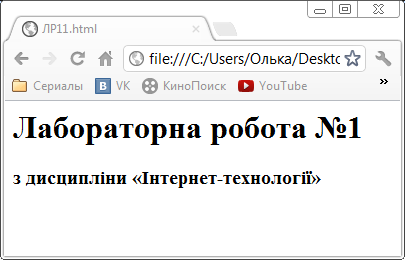
*Короткий опис: Відображення заголовків h1 та h3 у вікні веб-браузера.*

##### Новий абзац (`<p>`)
Тег `<p>` виділяє логічний блок тексту у новий абзац з вертикальним відступом:

```html
<html>
    <h1>Лабораторна робота №1</h1>
    <h3>з дисципліни «Інтернет-технології»</h3>
    <p>тема: "HTML-документ"</p>
</html>
```

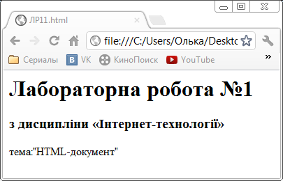
*Короткий опис: Відображення текстового абзацу з автоматичним відступом знизу.*

##### Перенесення рядка (`<br>`) та розділювальна лінія (`<hr>`)
Тег `<br>` здійснює примусове перенесення на новий рядок без створення великого міжрядкового інтервалу абзацу. Тег `<hr>` проводить горизонтальну розділювальну лінію:

```html
<html>
    <h1>Лабораторна робота №1</h1>
    <h3>з дисципліни «Інтернет-технології»</h3>
    <p>тема: "HTML-документ"</p>
    <br>студента(-ки) 941 групи
    <hr>Відділяємо частину документа горизонтальною лінією.
</html>
```

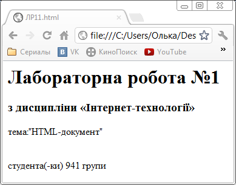
*Короткий опис: Текст з перенесенням рядка тегом `<br>`.*

##### Цитата (`<blockquote>`) та вирівнювання (`align`)
Тег `<blockquote>` робить виділення цитати з відступом праворуч. Атрибут `align` (`left`, `center`, `right`, `justify`) задає вирівнювання тексту:

```html
<html>
    <h1>Лабораторна робота №1</h1>
    <h3>з дисципліни «Інтернет-технології»</h3>
    <p>тема: "HTML-документ"</p>
    <br>студента(-ки) 941 групи
    <hr>Відділяємо частину документа горизонтальною лінією.
    <blockquote>Постав над собою 100 вчителів — вони виявляться безсилими, якщо ти не можеш вимагати від себе сам.</blockquote>
    <h6 align="right">Сухомлинський В.О.</h6>
</html>
```

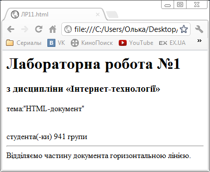
*Короткий опис: Блок цитати з відступом від лівого краю.*

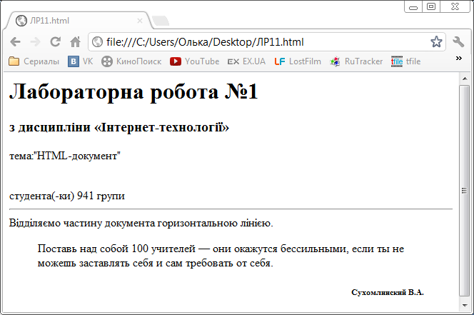
*Короткий опис: Комбінація розділювача `<hr>`, цитати `<blockquote>` та автора з вирівнюванням по правому краю.*

---

#### 3.2. Форматування тексту

- `<i> ... </i>` — виділення тексту курсивом (italics).
- `<b> ... </b>` — виділення напівжирним накресленням (bold).
- `<u> ... </u>` — підкреслення тексту (underline).
- `<s> ... </s>` або `<strike>` — закреслений текст (strikethrough).

```html
<html>
    <h1>Лабораторна робота №1</h1>
    <i><b><u><s>Форматування тексту</s></u></b></i>
</html>
```

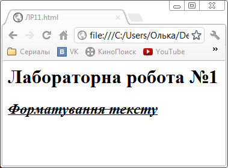
*Короткий опис: Комбіноване застосування тегів форматування символів.*

##### Зміна розміру шрифту, верхній та нижній індекси
- `<big>` — збільшений шрифт; `<small>` — зменшений шрифт.
- `<sup>` — верхній індекс (для математичних степенів, наприклад $E = mc^2$).
- `<sub>` — нижній індекс (для хімічних формул, наприклад $H_2O$).
- `<font color="...">` — завдання кольору тексту.

```html
<html>
    <h1>Лабораторна робота №1</h1>
    <font color="red"><h1>E = mc<sup>2</sup></h1></font>
    <font color="#00BFFF"><h1>H<sub>2</sub>O</h1></font>
</html>
```

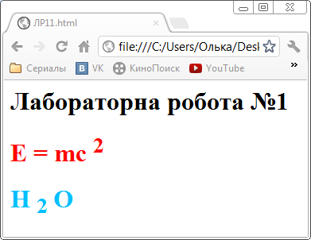
*Короткий опис: Математична та хімічна формули з використанням `<sup>`, `<sub>` та кольору тегу `<font>`.*

---

#### 3.3. Списки в HTML

HTML підтримує три базові види списків:

##### 1. Маркеровані списки (`<ul>`, `<li>`):
```html
<ul>
    <li>Елемент списку 1</li>
    <li>Елемент списку 2</li>
</ul>
```

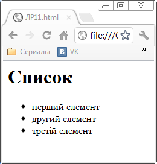
*Короткий опис: Маркерований список з круглими чорними маркерами за замовчуванням (disc).*

За допомогою атрибута `type` можна змінювати форму маркера: `circle` (коло) або `square` (квадрат):


*Короткий опис: Маркерований список із квадратними маркерами (`type="square"`).*

##### 2. Нумеровані списки (`<ol>`, `<li>`):
```html
<ol>
    <li>Перший пункт</li>
    <li>Другий пункт</li>
</ol>
```

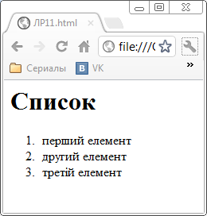
*Короткий опис: Стандартний нумерований список з арабськими цифрами.*

Атрибут `type` дозволяє обрати тип нумерації: `A` (великі літери), `a` (малі літери), `I` (великі римські цифри), `i` (малі римські цифри):

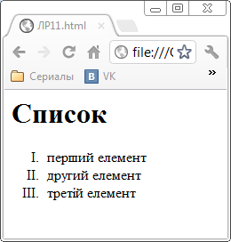
*Короткий опис: Нумерація великими римськими цифрами (`type="I"`).*

Атрибут `start` дозволяє розпочати відлік з довільного номера (наприклад, з 24):

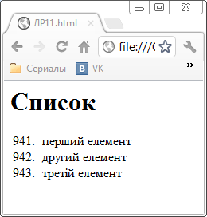
*Короткий опис: Нумерований список, що починається з 24-го елемента завдяки атрибуту `start="24"`.*

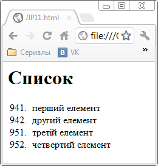
*Короткий опис: Вкладений список зі змішаною багаторівневою нумерацією.*

##### 3. Списки визначень (`<dl>`, `<dt>`, `<dd>`):
- `<dl>` — контейнер списку визначень.
- `<dt>` — термін, що визначається.
- `<dd>` — безпосередній опис або визначення терміна (виводиться зі зсувом праворуч).

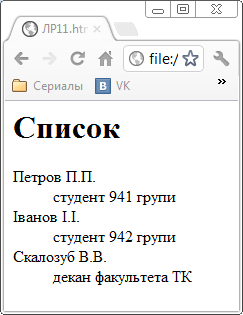
*Короткий опис: Базовий список визначень термінів.*

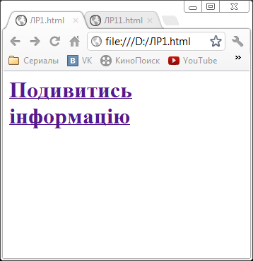
*Короткий опис: Приклад списку студентів та груп, структурованого через `<dl>`, `<dt>`, `<dd>`.*

---

#### 3.4. Гіперпосилання (`<a>`)

Тег `<a>` з обов'язковим атрибутом `href` створює гіперпосилання на іншу веб-сторінку, файл або зовнішній вебресурс:

```html
<a href="https://kpi.ua">Офіційний сайт університету</a>
```

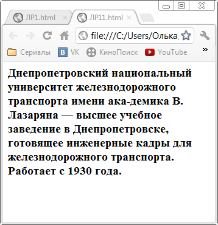
*Короткий опис: Текстове гіперпосилання синього кольору з підкресленням за замовчуванням.*

---

#### 3.5. Зображення на веб-сторінці (``)

Вставка зображень здійснюється одинарним тегом ``:

```html

```

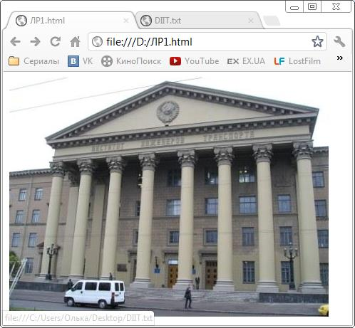
*Короткий опис: Вставка графічного зображення на сторінку через тег ``.*

Зображення також може бути поміщене всередину контейнера посилання `<a>`, стаючи клікабельною графічною кнопкою:

```html
<a href="info.html">
    
</a>
```

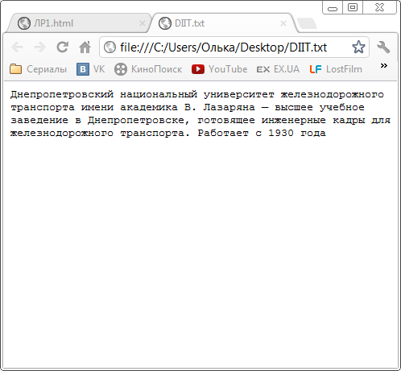
*Короткий опис: Зображення, обрамлене тегом `<a>`, що слугує клікабельним гіперпосиланням.*

---

#### 3.6. Таблиці в HTML (`<table>`, `<tr>`, `<td>`, `<th>`)

Таблиці використовуються для структурування рядків та стовпчиків даних:
- `<table>` — головний контейнер таблиці.
- `<tr>` (table row) — рядок таблиці.
- `<th>` (table header) — комірка заголовка (виділяється напівжирним шрифтом і вирівнюється по центру).
- `<td>` (table data) — звичайна комірка даних.
- Атрибут `border="1"` задає товщину рамки таблиці.

```html
<table border="1">
    <tr>
        <th>№</th>
        <th>Назва товару</th>
        <th>Ціна</th>
    </tr>
    <tr>
        <td>1</td>
        <td>Еспресо</td>
        <td>35 грн</td>
    </tr>
</table>
```

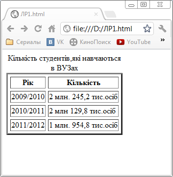
*Короткий опис: Проста HTML-таблиця з рамкою, заголовками стовпців та комірками даних.*

---

### 4. Висновок
У лабораторній роботі засвоєно практичні навички створення структурної розмітки веб-документів засобами HTML: створення текстових ієрархій, використання спеціальних символів і форматування, оформлення списків різних типів, вставка гіперпосилань, медіафайлів та робота з табличними даними.
