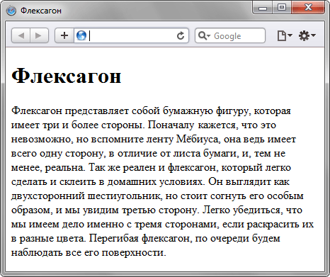
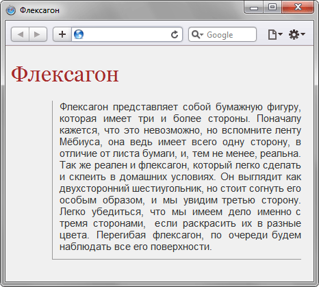
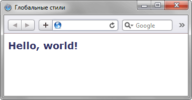
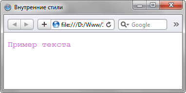
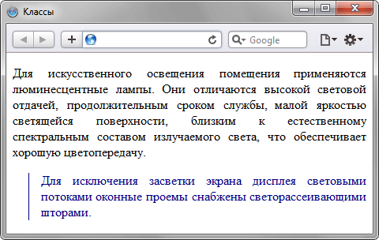
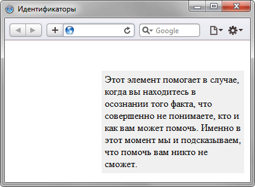
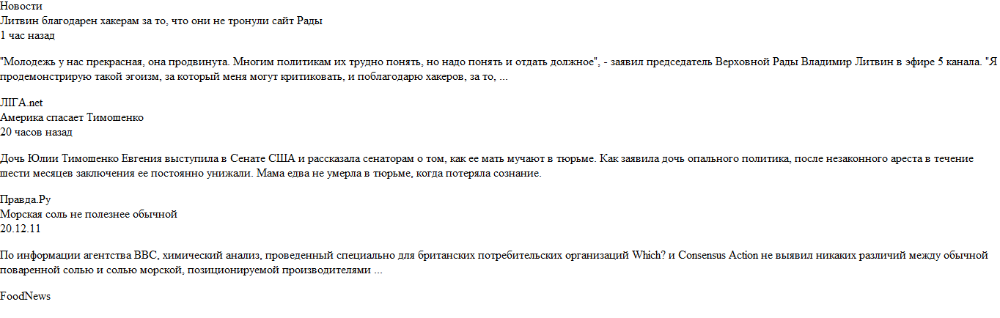
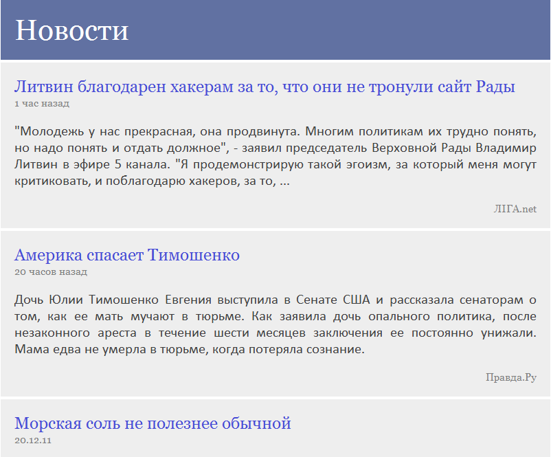

# Лабораторна робота №2: Введення в CSS та блочна верстка (DIV-верстка)

## 1. Загальні відомості про CSS

**CSS (Cascading Style Sheets — каскадні таблиці стилів)** — це набір параметрів форматування, що застосовується до елементів веб-документа для визначення їхнього зовнішнього вигляду: кольорів, шрифтів, розмірів, відступів та позиціонування на екрані.

Відокремлення логічної структури (HTML) від візуального оформлення (CSS) є фундаментальним принципом сучасної веб-розробки:
- Зменшується обсяг коду сторінок.
- Забезпечується централізоване керування дизайном: зміна одного CSS-файлу автоматично оновлює зовнішній вигляд усіх сторінок веб-ресурсу.
- Сторінки завантажуються швидше завдяки кешуванню файлу стилів браузером клієнта.


*Короткий опис: Концепція каскадних таблиць стилів CSS та керування зовнішнім виглядом сторінки.*


*Короткий опис: Порівняння відображення елементів у браузері без стилів та зі застосуванням CSS-оформлення.*

---

## 2. Способи підключення CSS до HTML

Існує чотири способи застосування стилів до веб-сторінки:

### 2.1. Вбудовані (Inline) стилі
Стиль задається безпосередньо у відкриваючому тегу елемента за допомогою атрибута `style`:
```html
<p style="color: red; font-size: 18px;">Цей текст оформлено через inline-стиль.</p>
```
*Недолік:* порушує принцип розділення коду і оформлення, створює дублювання при багаторазовому використанні.

### 2.2. Внутрішні (Internal / Embedded) стилі
Описуються всередині тегу `<style type="text/css">` у заголовній частині документа `<head>`:
```html
<head>
    <style type="text/css">
        h1 {
            font-size: 140%;
            font-family: Arial, sans-serif;
            color: #333366;
        }
    </style>
</head>
<body>
    <h1>Заголовок, стилізований внутрішнім CSS</h1>
</body>
```


*Короткий опис: Заголовок h1, оформлений через блок `<style>` у секції `<head>`.*

### 2.3. Зовнішні зв'язані стилі (Linked Styles) — Рекомендований спосіб
Таблиця стилів зберігається в окремому файлі з розширенням `.css` і підключається до HTML через тег `<link>` у секції `<head>`:
```html
<head>
    <link rel="stylesheet" type="text/css" href="style.css">
</head>
```

### 2.4. Імпортовані стилі
Імпортуються всередині блоку `<style>` за допомогою директиви `@import`:
```css
@import url("global.css");
```

---

## 3. Базовий синтаксис та селектори CSS

Стильове правило складається з двох частин: **селектора** (вказує, на які елементи діє правило) та **блоку оголошень** (у фігурних дужках властивості та їх значення):

```css
селектор {
    властивість1: значення;
    властивість2: значення;
}
```

### Основні типи селекторів:

1. **Селектор за тегом:** Застосовується до всіх однойменних HTML-тегів на сторінці:
   ```css
   p {
       line-height: 1.6;
       color: #222;
   }
   ```

2. **Селектор класу (`.class`):** Універсальний стиль, який можна присвоїти багатьом елементам на сторінці через атрибут `class`:
   ```css
   .highlight {
       background-color: #fff3cd;
       padding: 5px;
       border-left: 4px solid #ffc107;
   }
   ```

3. **Селектор ідентифікатора (`#id`):** Застосовується до єдиного унікального елемента на сторінці з відповідним атрибутом `id`:
   ```css
   #header-logo {
       width: 180px;
       margin: 0 auto;
   }
   ```


*Короткий опис: Демонстрація стилізації окремих елементів тексту за допомогою селекторів класів та ID.*


*Короткий опис: Вигляд абзаців тексту з додаванням стилевого класу з рамкою зліва та зміненим кольором.*


*Короткий опис: Оформлення блоку з унікальним ідентифікатором за правилом `#id`.*

---

## 4. Блочна модель (CSS Box Model)

Кожен елемент у документі представляється браузером у вигляді прямокутної коробки (box), що складається з таких шарів (від центру назовні):
1. **Content (Вміст):** текст, зображення чи дочірні елементи.
2. **Padding (Внутрішній відступ):** простір між вмістом і внутрішнім краєм рамки. Має колір фону блоку.
3. **Border (Рамка / Межа):** лінія навколо внутрішнього поля.
4. **Margin (Зовнішній відступ):** порожній простір між рамкою даного елемента та сусідніми елементами сторінки.


*Короткий опис: Блочна модель CSS (Box Model) із зонами content, padding, border та margin.*

---

## 5. Блочна верстка та властивість обтікання (Float Layout)

Для побудови багатоколонкових макетів використовуються контейнери `<div>` та властивість `float`:
- `float: left` — притискає блок до лівого краю батьківського контейнера, дозволяючи наступному вмісту обтікати його справа.
- `float: right` — притискає блок до правого краю.
- `clear: both` або `overflow: hidden` — скидання обтікання (clearfix), запобігає випадінню плаваючих блоків з потоку документа.

---

## 6. Практичний приклад блочної верстки новинної стрічки

Розглянемо практичний приклад верстки компонента стрічки новин (або каталогу) до та після застосування каскадних таблиць стилів.

### Вигляд без стилів (чистий HTML):
Без стилізації контент відображається у звичайному вертикальному потоці без акцентів, структурованих відступів та кольорового розмежування блоків:


*Короткий опис: Зовнішній вигляд елементів новинної стрічки в браузері без використання CSS-стилів.*

### Вигляд після застосування CSS:
З додаванням CSS макет отримує чітку модульну сітку, відступи, гармонійні кольори, вирівнювання за шириною та стилізовані метадані:


*Короткий опис: Завершений вигляд модульного блоку новин зі структурованими відступами, фоном та типографікою завдяки CSS.*

### Реалізація коду CSS для блоків:
```css
/* Контейнер новинної картки */
.element_div {
    margin-bottom: 12px;
    padding: 16px;
    font-family: Georgia, serif;
    font-size: 15px;
    background-color: #f7f7f7;
    border: 1px solid #e0e0e0;
    border-radius: 4px;
}

/* Заголовок елемента */
.news_header_div {
    color: #3b429f;
    font-size: 20px;
    font-weight: bold;
    margin-bottom: 8px;
}

/* Тіло повідомлення */
.news_info_div {
    color: #333333;
    font-size: 15px;
    text-align: justify;
    line-height: 1.5;
}

/* Дата та час */
.post_time_div {
    color: #888888;
    font-size: 12px;
    float: left;
}

/* Джерело / автор */
.news_source_div {
    color: #888888;
    font-size: 12px;
    float: right;
}

/* Очищення обтікання (Clearfix) */
.bottom_div {
    overflow: hidden;
    margin-top: 10px;
}
```

---

## 7. Висновок
У лабораторній роботі було детально опановано засоби каскадних таблиць стилів CSS для зміни візуального оформлення веб-документа, підключення стилів через зовнішні файли `.css`, роботу з селекторами, блочною моделлю Box Model та принципи багатоколонкової блочної верстки за допомогою `<div>` та властивостей позиціонування.
