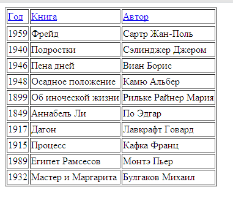
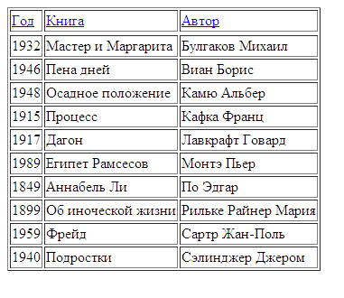

# Лабораторна робота №3: Основи мови програмування JavaScript у веб-технологіях

## 1. Теоретичні відомості

**JavaScript (JS)** — це динамічна мова сценаріїв, яка є стандартом де-факто для програмування клієнтської логіки у веб-браузерах. Якщо HTML відповідає за структуру документа, а CSS — за його зовнішній вигляд, то JavaScript оживляє сторінку, забезпечуючи інтерактивність, валідацію форм, динамічне оновлення DOM без перезавантаження та взаємодію з користувачем.

### Ключові можливості JavaScript у браузері:
- Маніпуляція об'єктною моделлю документа (DOM): динамічне створення, зміна або видалення елементів, атрибутів і стилів.
- Обробка подій користувача (Event Handling): натискання кнопок миші, введення тексту у форми, прокручування сторінки, сабміт форми.
- Асинхронний обмін даними із сервером (AJAX, Fetch API, WebSocket).
- Збереження даних на стороні клієнта (`localStorage`, `sessionStorage`, `cookies`).

---

## 2. Способи впровадження JavaScript в HTML

1. **Всередині тегу `<script>` у самому документі:**
   ```html
   <script type="text/javascript">
       console.log("Скрипт успішно запущено");
   </script>
   ```

2. **Підключення зовнішнього JS-файлу (рекомендований студентський стандарт):**
   ```html
   <script src="script.js" defer></script>
   ```
   *Атрибут `defer` гарантує, що скрипт виконається тільки після повного розбору структури HTML-документа.*

3. **Обробники подій як атрибути HTML-тегів (Inline Event Handlers):**
   ```html
   <button onclick="alert('Клік по кнопці!')">Натисни мене</button>
   ```

---

## 3. Обробники подій (Event Handlers)

JavaScript реагує на дії користувача за допомогою подій:
- `onclick`: клік лівою кнопкою миші.
- `onchange`: зміна значення елемента форми (наприклад, випадаючого списку `<select>`).
- `oninput`: введення символів у текстове поле `<input>`.
- `onsubmit`: відправка форми `<form>`.
- `onload`: завершення завантаження сторінки або зображення.

Синтаксис реєстрації обробника у сучасному JavaScript:
```javascript
const myButton = document.getElementById("btnCalculate");
myButton.addEventListener("click", function() {
    // Логіка розрахунку
});
```

---

## 4. Практичний випадок: Динамічна генерація та сортування таблиці даних

У лабораторній роботі розглядається приклад створення структури даних на мові JavaScript, динамічної побудови HTML-таблиці в DOM-дереві та реалізація інтерактивного сортування записів за стовпцями без перезавантаження сторінки.

### Початковий вигляд таблиці до сортування:
Скрипт зчитує масив об'єктів та будує рядки `<tr>` і комірки `<td>` всередині контейнера `<tbody>`:


*Короткий опис: Початковий вигляд HTML-таблиці з переліком записів, згенерованої скриптом JavaScript до сортування.*

### Результат після сортування (натискання на заголовок "Автор"):
При кліку на клікабельне посилання в шапці спрацьовує функція швидкого сортування `quickSort()`, яка впорядковує вихідний масив і повторно рендерить вміст `<tbody>`:


*Короткий опис: Таблиця після автоматичного сортування записів за стовпцем "Автор" за алфавітом.*

### Приклад коду генерації таблиці через DOM API:
```javascript
// Конструктор запису
function BookItem(year, book, author) {
    this.year = year;
    this.book = book;
    this.author = author;
}

// Масив даних
const items = [
    new BookItem("1849", "Аннабель Лі", "По Едгар"),
    new BookItem("1917", "Дагон", "Лавкрафт Говард"),
    new BookItem("1915", "Процес", "Кафка Франц"),
    new BookItem("1932", "Майстер і Маргарита", "Булгаков Михайло")
];

// Функція динамічної побудови рядків таблиці
function renderTable(data) {
    const tbody = document.getElementById("tablebody");
    tbody.innerHTML = ""; // Очищуємо старі рядки

    data.forEach(item => {
        const row = document.createElement("tr");

        const tdYear = document.createElement("td");
        tdYear.textContent = item.year;
        row.appendChild(tdYear);

        const tdBook = document.createElement("td");
        tdBook.textContent = item.book;
        row.appendChild(tdBook);

        const tdAuthor = document.createElement("td");
        tdAuthor.textContent = item.author;
        row.appendChild(tdAuthor);

        tbody.appendChild(row);
    });
}
```

---

## 5. Висновок
У лабораторній роботі вивчено синтаксис та базові концепції мови JavaScript, методи вибірки та динамічного створення елементів DOM-дерева, перехоплення подій користувача та реалізацію алгоритмічної обробки даних на стороні браузера.
