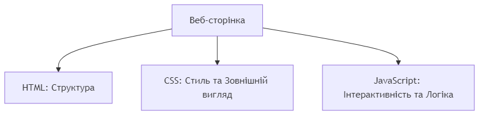
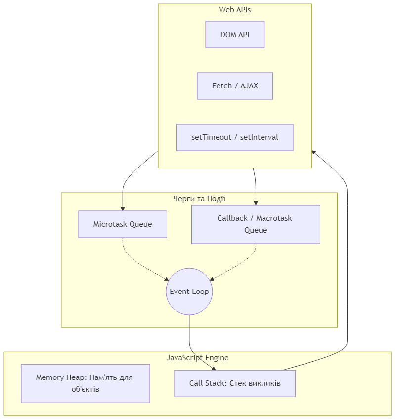
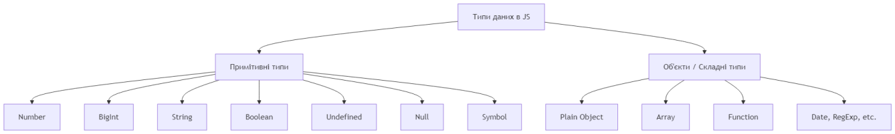
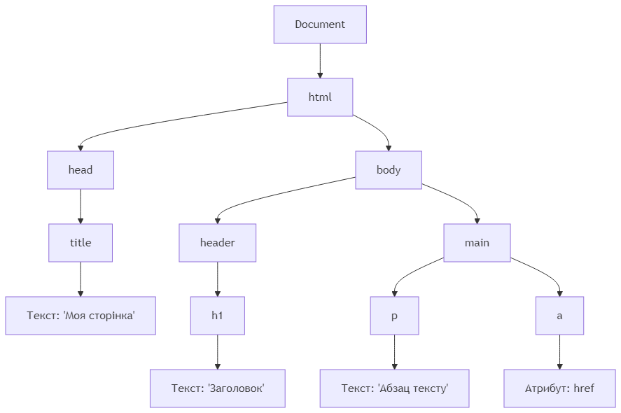
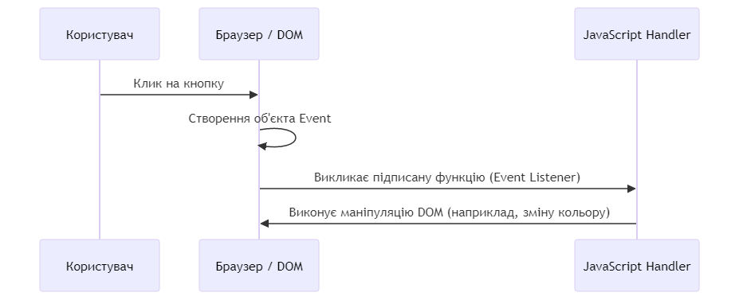
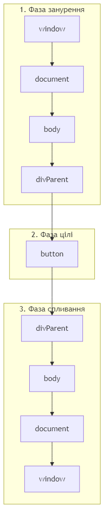

# Лекція / Лабораторне заняття №3: Основи мови JavaScript та маніпуляція DOM


*Короткий опис: Офіційний логотип мови JavaScript та символіка її ключової ролі у сучасній веб-екосистемі.*

---

## 1. Вступ до JavaScript та стандартизація ECMAScript

**JavaScript** — це високорівнева, динамічно типізована, багатопарадигменна мова програмування, що підтримує об'єктно-орієнтований, функціональний та імперативний стилі.

Мова була створена Бренданом Ейхом (Brendan Eich) у 1995 році в компанії Netscape за рекордні 10 днів під назвою *Mocha*, потім перейменована в *LiveScript*, і зрештою — в *JavaScript*.

Для запобігання фрагментації та несумісності браузерів мова була стандартизована міжнародною організацією **Ecma International** у вигляді специфікації **ECMAScript (ECMA-262)**:
- **ES5 (2009):** Суворий режим (`"use strict"`), нативна підтримка JSON, ітераційні методи масивів (`forEach`, `map`, `filter`).
- **ES6 / ECMAScript 2015:** Революційний реліз: змінні `let` і `const`, стрілкові функції `() => {}`, синтаксис класів `class`, проміси `Promise`, шаблонні рядки, деструктуризація, модулі `import/export`.
- **ES2016+:** Щорічний реліз оновлень: `async/await`, оператор нульового злиття `??`, оператор опціонального ланцюжка `?.`.

---

## 2. Середовище виконання JavaScript та цикл подій (Event Loop)

JavaScript у браузері є **однопотоковим** (Single-threaded) — одночасно може виконуватися лише одна інструкція в головному потоці.


*Короткий опис: Архітектурна схема середовища виконання браузера: стек викликів (Call Stack), купа пам'яті (Memory Heap), браузерні API (Web APIs), черга зворотних викликів (Callback Queue) та цикл подій (Event Loop).*

### Складові частини браузерного середовища:
1. **Call Stack (Стек викликів):** Структура LIFO (Last In, First Out), яка стежить за порядком виклику та виконання функцій.
2. **Memory Heap (Купа пам'яті):** Область неструктурованої динамічної пам'яті, де виділяється місце під складні об'єкти та масиви.
3. **Web APIs:** Надаються браузером: робота з DOM, таймери `setTimeout`, мережеві запити `fetch()`, локальне сховище.
4. **Callback Queue (Черга зворотних викликів):** Черга FIFO, куди потрапляють асинхронні обробники після настання подій або спрацьовування таймера.
5. **Event Loop (Цикл подій):** Механізм, що безперервно перевіряє: якщо стек викликів порожній, він витягує першу функцію з черги завдань і відправляє її на виконання в стек.

---

## 3. Змінні та система типів даних

Оголошення змінних здійснюється за допомогою ключових слів:
- `const`: Оголошення константи, значення якої не можна переприсвоїти.
- `let`: Змінна з блочною областю видимості, значення якої можна змінювати.
- `var`: Застарілий спосіб оголошення з функціональною областю видимості та спливанням (hoisting). Не рекомендований у сучасному коді.


*Короткий опис: Ієрархія та класифікація типів даних у JavaScript: примітивні значення та складні посилальні типи (Objects).*

### Класифікація типів даних:
1. **Примітивні типи (передаються за значенням):**
   - `Number`: цілі числа та числа з плаваючою крапкою подвійної точності IEEE 754.
   - `String`: текстові рядки.
   - `Boolean`: логічні значення `true` або `false`.
   - `Null`: навмисна відсутність об'єкта або значення.
   - `Undefined`: значення змінної, яка була оголошена, але не ініціалізована.
   - `BigInt`: цілі числа довільної довжини.
   - `Symbol`: унікальний ідентифікатор.
2. **Складні типи (передаються за посиланням):**
   - `Object`: структури типу "ключ: значення", масиви `Array`, функції `Function`, дати `Date`.

---

## 4. Об'єктна модель документа (DOM — Document Object Model)

**DOM** — це програмний API-інтерфейс для документів HTML/XML. Браузер перетворює розмітку сторінки на деревоподібну структуру об'єктів (вузлів), з якою може взаємодіяти код JavaScript.


*Короткий опис: Деревоподібна ієрархія вузлів документа DOM: об'єкт Document, кореневий вузол `<html>`, гілки `<head>` та `<body>`, дочірні вузли елементів та тексту.*

### Основні методи пошуку та вибірки елементів у DOM:
- `document.getElementById('id')`: швидкий пошук за унікальним ідентифікатором.
- `document.querySelector('selector')`: повертає перший знайдений елемент за довільним CSS-селектором.
- `document.querySelectorAll('selector')`: повертає статичну псевдоколекцію `NodeList` усіх відповідних елементів.

---

## 5. Маніпуляція елементами DOM та стилями

### Створення та додавання елементів:
```javascript
// Створення нового тегу
const newCard = document.createElement('div');
newCard.className = 'coffee-card';
newCard.textContent = 'Капучино — 55 грн';

// Додавання у контейнер
const catalog = document.querySelector('.catalog');
catalog.appendChild(newCard); // або catalog.append(newCard);
```

### Керування класами через `classList`:
- `element.classList.add('active')` — додати клас.
- `element.classList.remove('active')` — видалити клас.
- `element.classList.toggle('active')` — перемкнути наявність класу.
- `element.classList.contains('active')` — перевірити наявність класу (повертає boolean).


*Короткий опис: Зв'язок між деревом DOM, об'єктною моделлю стилів CSSOM та методами маніпуляції через classList і style.*

---

## 6. Події, поширення подій (Event Flow) та делегування

Події є сигналами браузера про дії користувача (клік, сабміт, фокус, введення символу).


*Короткий опис: Три фази життєвого циклу події у DOM: фаза занурення (Capturing Phase), фаза досягнення цілі (Target Phase) та фаза спливання (Bubbling Phase).*

### Фази проходження події:
1. **Фаза занурення (Capturing):** подія спускається від об'єкта `window` і `document` вниз по DOM-дереву до цільового елемента.
2. **Фаза цілі (Target):** подія досягає безпосереднього елемента, на якому відбулася дія (`event.target`).
3. **Фаза спливання (Bubbling):** подія піднімається назад угору від цільового елемента до кореня `window`.

### Делегування подій (Event Delegation):
Завдяки спливанню подій можна призначити один обробник на батьківський контейнер замість додавання сотень обробників на кожну дочірню кнопку:
```javascript
const orderList = document.querySelector('#orders-list');
orderList.addEventListener('click', (event) => {
    // Перевіряємо, чи клікнули по кнопці видалення
    if (event.target.classList.contains('btn-delete')) {
        const item = event.target.closest('.order-item');
        item.remove();
    }
});
```

---

## 7. Практичний шаблон студента: Динамічний веб-модуль

```javascript
document.addEventListener('DOMContentLoaded', () => {
    const form = document.querySelector('#order-form');
    const input = document.querySelector('#drink-select');
    const list = document.querySelector('#order-list');
    const totalDisplay = document.querySelector('#total-val');

    let total = 0;

    form.addEventListener('submit', (e) => {
        e.preventDefault(); // Скасовуємо перезавантаження сторінки
        
        const option = input.options[input.selectedIndex];
        const name = option.text;
        const price = parseFloat(option.value);

        if (!price) return;

        // Створюємо елемент у списку
        const li = document.createElement('li');
        li.textContent = `${name} — ${price} грн`;
        list.appendChild(li);

        // Оновлюємо загальну суму
        total += price;
        totalDisplay.textContent = total + ' грн';
    });
});
```

---

## 8. Висновок
Опановано ключові принципи мови JavaScript стандарту ECMAScript, механізми роботи браузерного середовища та черги подій Event Loop, об'єктне дерево DOM, безпечні методи маніпуляції контентом і класами та ефективні шаблони обробки подій з використанням делегування.
